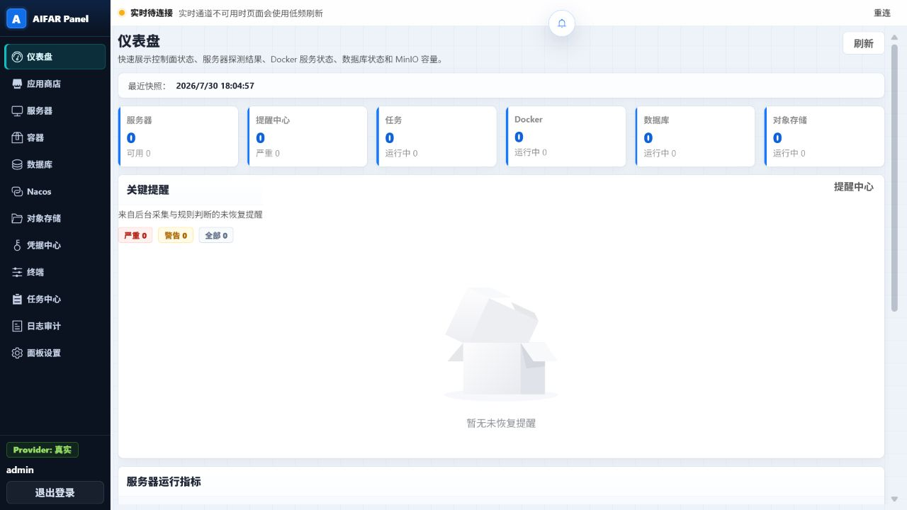
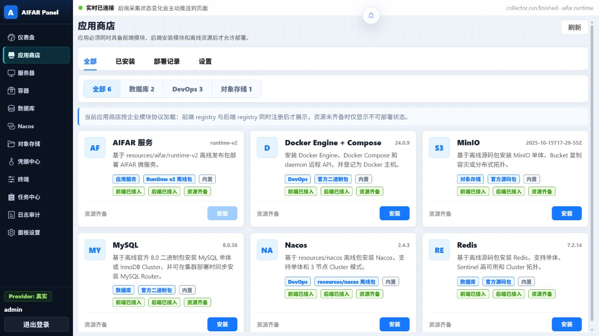
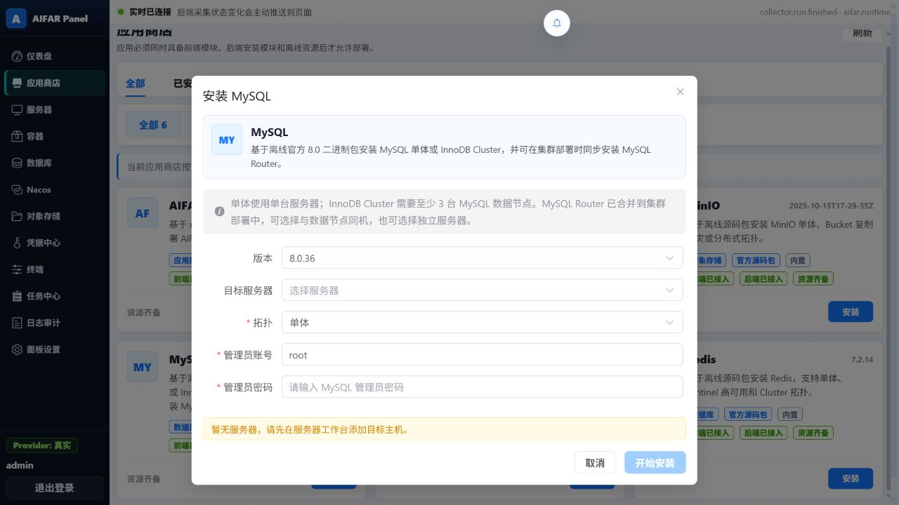
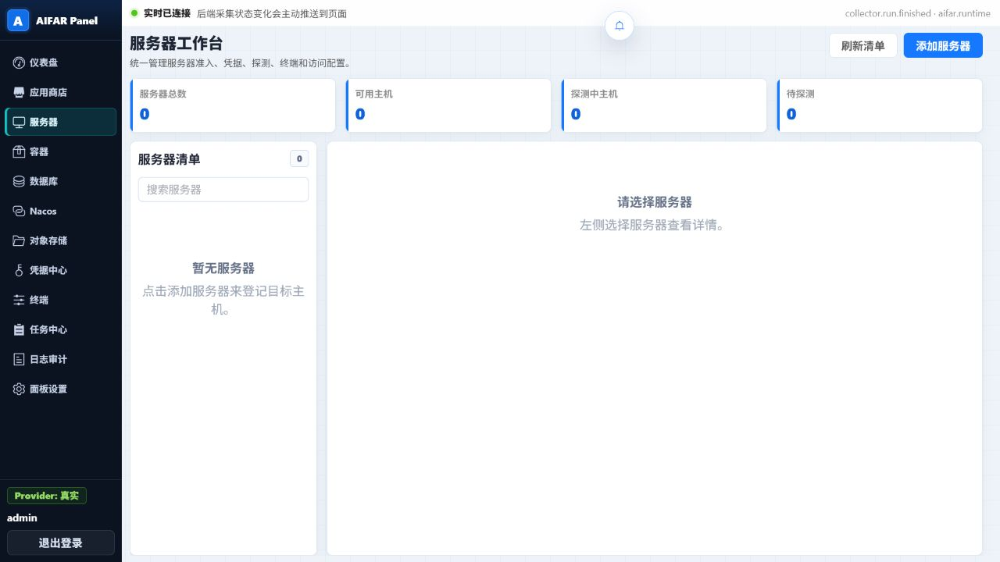
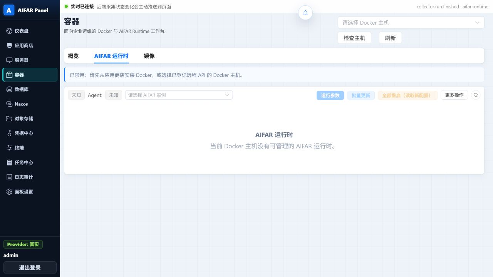
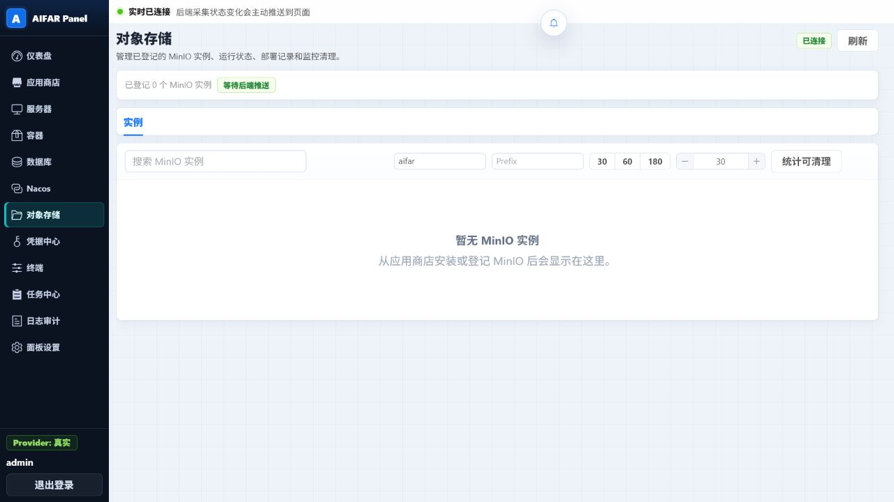
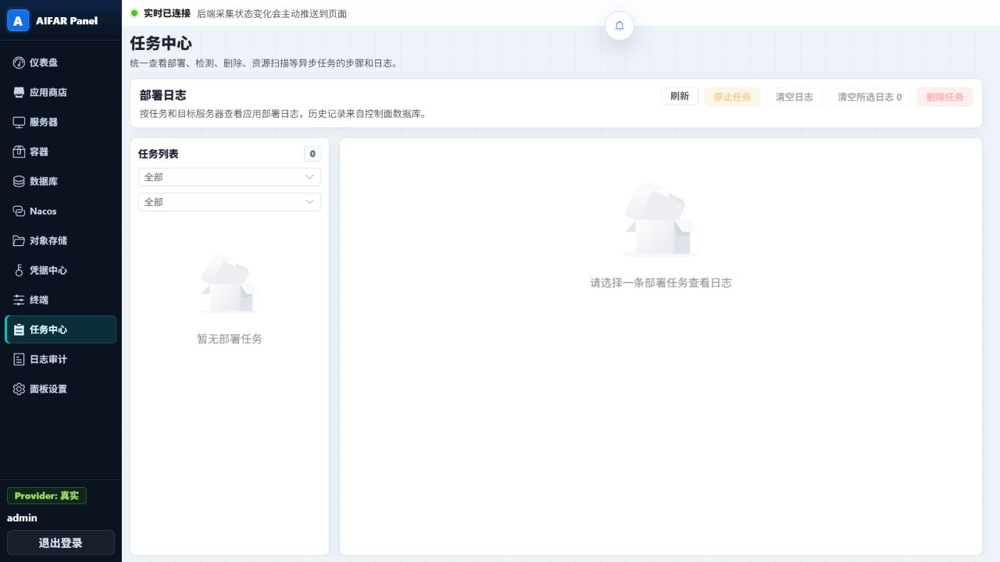
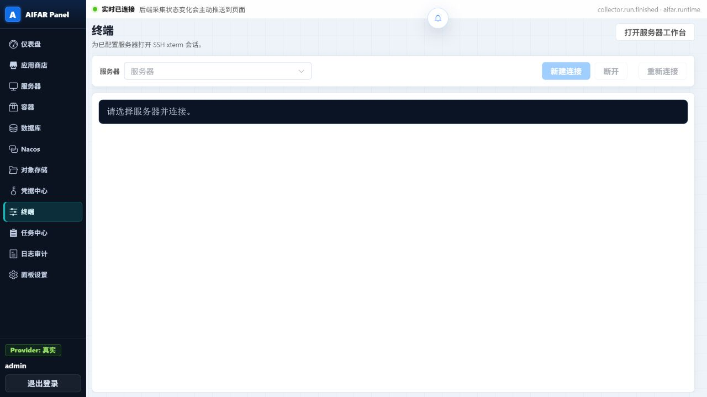

# AIFAR Panel 实际能力清单

> 核对日期：2026-07-30  
> 核对依据：当前工作区源码、已注册 API、当前离线资源，以及使用全新隔离演示数据库运行得到的真实界面。  
> 说明：截图证明当前页面和操作入口真实存在，但不等同于本轮已连接真实 Linux、SSH、Docker 或数据库环境并完成部署验收。

## 1. 它是什么

AIFAR Panel 是一套面向私有化、离线环境的 Linux 部署与运维控制面。它把“目标服务器接入、离线软件安装、服务状态查看、运行时操作、任务追踪、终端连接、凭据与审计”集中在一个 Web 面板中。

典型使用主线是：

1. 在“服务器”登记目标 Linux 主机并执行 SSH 探测。
2. 在“凭据中心”维护应用安装所需的凭据。
3. 在“应用商店”选择离线软件、版本、拓扑和目标服务器，提交安装任务。
4. 在“任务中心”查看每个目标、每个步骤和日志，确认成功或定位失败。
5. 在“容器、数据库、Nacos、对象存储”等工作台继续做运行状态检查和运维操作。
6. 在“日志审计”追溯谁在什么时间做了什么变更。

## 2. 已实际具备的能力

| 能力域 | 它是什么 | 主要用途 | 当前实际状态与边界 |
| --- | --- | --- | --- |
| 登录、账号与权限 | JWT 登录、用户角色和细粒度权限控制 | 区分 owner/admin/operator/viewer/auditor，可限制服务器、应用、容器、终端、凭据、设置、审计等操作 | 已接入；部分菜单会随权限隐藏。viewer/auditor 默认只读权限集合为空，是否能看到数据仍由具体接口鉴权决定 |
| 仪表盘与提醒 | 汇总服务器、任务、Docker、数据库、MinIO 和提醒状态 | 值班时快速判断控制面是否健康、哪里需要优先处理 | 已接入状态快照、提醒列表及实时事件；提醒支持确认、静默和解决权限 |
| 服务器工作台 | 维护目标主机、SSH 凭据、部署目录、排序、探测和遥测 | 为后续部署、终端和运行时操作建立受管目标 | 已具备新增、编辑、删除、排序、探测、磁盘信息、遥测；真实结果依赖目标 SSH 与网络可达 |
| 离线资源与应用商店 | 扫描 `resources` 并把前端模块、后端模块、离线资源三方配对 | 防止“只有界面或只有安装器”时误部署；统一选择版本、拓扑和目标服务器 | 当前页面识别出 6 类应用，只有三方齐备才允许安装；资源扫描也进入任务与审计 |
| 应用生命周期 | 安装、检测、删除/远程卸载、批量删除实例 | 统一管理应用从部署到核验、清理的生命周期 | 已接入；状态变更为异步任务，不是点击后同步完成；失败安装可保留实例用于后续清理 |
| Docker 工作台 | 查看 Docker 主机、容器、镜像、磁盘占用和运行日志 | 日常查看容器状态，执行启停、重启、删除和批量操作 | 已具备容器 start/stop/restart/remove、批量操作、日志、镜像删除；底层通过本地或 SSH 远程 Docker CLI，不是 Docker Go Client |
| AIFAR Runtime | 管理 AIFAR 服务和 Pod 的期望态、运行参数、日志、制品与诊断 | 扩缩容、下线、批量下线、同步期望态、读取新配置、诊断导出、发布更新与回滚 | 已具备运行状态、增量日志、CPU/内存/JVM 参数、服务安装、扩缩容、下线、全部重启、残留清理、agent 卸载、诊断包估算/导出/下载/删除；操作依赖已安装的 runtime-v2 和可用 agent |
| 数据库工作台 | 聚合 MySQL、MySQL Router 和 Redis 实例、节点、角色与状态 | 查看数据库拓扑，启动 MySQL 集群，执行 MySQL 备份、校验、恢复和灾难重建流程 | 已接入实例监测、MySQL 集群启动、备份/校验/删除、恢复、维护门禁与调和入口；高风险恢复需要 owner 权限并满足停写等前提 |
| Nacos 工作台 | 管理 Nacos 单体/集群实例、节点与配置修订 | 查看 Nacos 状态，预览、发布和回滚配置 | 已接入实例列表、配置预览、发布、修订历史与回滚；必须先存在可用 Nacos 实例和凭据 |
| 对象存储工作台 | 管理已登记 MinIO 实例、状态、容量与清理策略 | 查看 MinIO，估算指定 Bucket/Prefix 的可清理对象，并应用/停用生命周期策略 | 清理估算和清理策略是任务化操作；Bucket/Object/User/Access Key/Replica 的增删目前主要是控制面记录，不应等同于完整 MinIO API 或 `mc` 实操 |
| 凭据中心 | 加密保存 MySQL、Redis、Nacos、MinIO 等应用凭据 | 安装和配置发布时只引用凭据 ID，减少明文在页面和任务之间流转 | 已具备新增、编辑、启停、引用检查和受保护删除；服务器 SSH 密码、私钥及应用 secret 使用 AES-GCM 加密保存 |
| SSH 终端 | 浏览器内 xterm.js SSH 会话 | 在授权下直接进入已登记服务器排查问题 | 已具备 WebSocket 鉴权、多会话和重连；最多同屏展示 4 个会话，刷新、关闭浏览器或退出登录会清理会话 |
| 任务中心 | 展示异步任务、目标、步骤、状态和 SSE 日志 | 观察部署/检测/删除/扫描/备份等操作是否真正完成，并按目标定位失败 | 已具备任务列表、详情、实时日志、停止任务、清日志和删除记录；取消为尽力而为，不能把“已请求取消”理解为远端动作已经回滚 |
| 日志审计 | 记录关键操作及结果 | 满足问题追踪和操作留痕 | 已具备查询与按权限删除；日志和审计应保持脱敏 |
| 面板设置与维护 | 管理语言、任务并发、账号角色、模块状态、控制面数据库备份和保留期 | 调整面板运行参数，备份面板自身 SQLite 数据，清理过期任务和审计记录 | 已具备；这里的数据库备份是 Panel 控制面数据库备份，不等同于 MySQL 业务库备份 |

## 3. 当前可部署的离线应用

| 应用 | 当前页面版本/资源 | 已支持拓扑或用途 |
| --- | --- | --- |
| AIFAR 服务 | runtime-v2 离线包 | 单套 AIFAR 微服务部署，后续由 Runtime 工作台管理 |
| Docker Engine + Compose | 24.0.9 | 安装 Docker Engine、Compose、远程 API，并登记 Docker 主机 |
| MySQL | 8.0.36 | Standalone；InnoDB Cluster（至少 3 个数据节点），集群部署可同步配置 MySQL Router |
| Redis | 7.2.14 | Standalone；Sentinel 高可用；Redis Cluster |
| MinIO | 2025-10-15T17-29-55Z | Standalone；Bucket 复制容灾；Distributed（至少 4 台） |
| Nacos | 2.4.3 | Standalone；3 节点 Cluster |

## 4. 关键界面截图

以下截图均来自当前代码实际运行的页面，使用全新隔离数据库，因此没有生产主机、业务数据或成功部署记录。

### 4.1 仪表盘：先看整体是否健康

用途：汇总服务器、提醒、任务、Docker、数据库和对象存储状态，是日常巡检的第一入口。

### 4.2 应用商店：看当前能部署什么

用途：展示已配对的前端模块、后端模块和离线资源；当前可见 AIFAR、Docker、MySQL、Redis、MinIO、Nacos 六类应用。

### 4.3 安装向导：选择版本、拓扑和目标服务器

用途：安装不是卡片一键直装，而是先确认版本、目标、拓扑和凭据，再提交后台任务。图中没有服务器，所以“开始安装”保持禁用，这是当前真实空环境状态。

### 4.4 服务器工作台：建立受管目标

用途：添加服务器、维护访问配置、执行探测，并从左侧清单进入单机详情。

### 4.5 AIFAR Runtime：管理服务期望态和运行实例

用途：选择 Docker 主机和 AIFAR 实例后，可进入运行参数、批量更新、全部重启、扩缩容、下线、日志和诊断操作。没有 runtime-v2 时入口会明确禁用。

### 4.6 对象存储：MinIO 状态和清理入口

用途：查看 MinIO 实例，并按 Bucket、Prefix、保留天数估算清理范围；真正应用策略前仍需实例和凭据满足条件。

### 4.7 任务中心：确认操作是否真的完成

用途：查看任务、目标、步骤和日志；停止、清日志、删除记录等按钮会根据当前选择和权限启用。

### 4.8 SSH 终端：进入受管服务器排障

用途：选择已登记服务器后建立 xterm.js SSH 会话；没有服务器时不会伪造连接成功状态。

## 5. 需要特别避免的误解

- “页面有按钮”不等于本轮已在真实服务器执行成功。远端安装与运维仍依赖 SSH、操作系统、离线资源、Docker/agent 和目标服务状态。
- “任务已提交”不等于“操作已完成”。必须在任务中心看到最终状态、步骤和目标日志。
- “对象存储有 Bucket/Object/User 等页签”不等于已实现完整 MinIO 管理客户端；当前控制面记录与真实 `mc`/S3 操作要分开理解。
- “停止任务”只取消当前 pending/running worker 任务；“服务下线”才是把 Runtime 服务期望副本数设为 0，两者不是一回事。
- “全部重启（读取新配置）”会重建当前所选实例的在线 Runtime Pods；期望副本为 0 的服务保持下线，失败不会自动恢复所有旧容器。
- 面板设置里的“数据库备份”保护 Panel 自身 SQLite 控制面数据；MySQL 业务库备份在数据库工作台中单独执行。
- `/toolbox` 路由仍存在，但当前正式侧边栏没有“工具箱”入口，因此本清单不把它算作主要可见能力。

## 6. 一句话定位

AIFAR Panel 现在已经不是单纯的安装页面，而是一套以“服务器准入 + 离线应用部署 + AIFAR Runtime 运维 + 数据/中间件工作台 + 任务审计”为主线的私有化运维控制面；它能组织和追踪真实远程操作，但不会替代目标环境本身的可用性和灾备验收。
