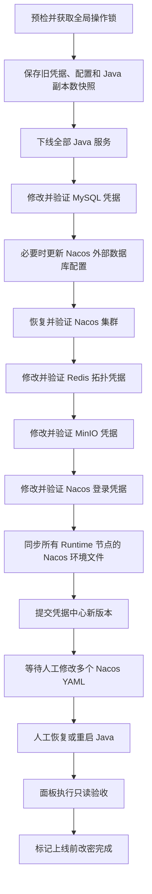

# AIFAR 上线前基础服务凭据改密设计

## 1. 文档状态

- 状态：已确认设计
- 日期：2026-07-26
- 适用仓库：`D:\workspace\aifar-deployment`
- 适用场景：正式上线前，无业务连续性和停机时长要求

## 2. 背景

当前 AIFAR 环境包含 MySQL、Redis、MinIO、Nacos 和 AIFAR Java Runtime。服务安装成功后，面板会在凭据中心登记相应凭据，但直接编辑凭据中心记录只会修改面板 SQLite 中保存的密文，不会修改远端服务密码。

Java 服务通过环境文件获取 Nacos 地址、账号、密码和 namespace：

- `java-common.env` 保存 `NACOS_HOST`、`NACOS_USER`、`NACOS_NS` 等非敏感配置。
- `java-secrets.env` 保存 `NACOS_PASSWORD`。

MySQL、Redis、MinIO 的业务连接密码没有通过 Java 环境变量统一注入，而是直接写在多个 Nacos YAML Data ID 中。这些 YAML 的层级和字段名不统一，无法建立安全、通用的自动替换规则。自动扫描或正则替换存在误改业务配置的高风险。

因此，本设计采用“自动修改基础服务凭据，人工修改异构 Nacos 业务 YAML，人工恢复 Java，面板最终只读验收”的边界。

## 3. 目标

管理面板提供一次上线前基础服务改密流程，负责：

1. 识别 MySQL、Redis、MinIO、Nacos 的 standalone 或集群拓扑。
2. 校验旧凭据、目标服务器、集群健康和任务冲突。
3. 记录并下线全部 AIFAR Java 服务，保存原始副本数。
4. 修改 MySQL、Redis、MinIO、Nacos 的服务端密码。
5. 在 Nacos 使用被修改 MySQL 账号时，同步更新 Nacos 节点的外部数据库密码。
6. 将新 Nacos 账号和密码同步到所有 AIFAR Runtime 节点的环境文件。
7. 更新凭据中心的凭据版本、绑定状态和验证结果。
8. 在自动阶段失败时执行反向补偿回滚。
9. 自动阶段成功后进入等待人工配置状态。
10. 用户完成 Nacos YAML 修改和 Java 恢复后，由面板执行只读上线前验收。

## 4. 非目标

本功能不负责：

- 自动读取、识别或修改业务 Nacos YAML 中的 MySQL、Redis、MinIO字段。
- 自动恢复或重启 Java 服务。
- 在用户手工修改 Nacos YAML 后承诺全自动配置回滚。
- 修改 `AIFAR_CREDENTIAL_SECRET`、`AIFAR_JWT_SECRET`、面板用户密码或 SSH密码。
- 修改 MySQL Group Replication内部恢复账号、Redis内部系统账号等未登记为业务凭据的内部认证信息。
- 为运行期零中断改密实现双账号、Redis ACL蓝绿切换或临时扩容。

## 5. 产品入口

### 5.1 唯一执行入口

唯一执行入口放在现有“凭据中心”页面 `/credentials` 顶部，按钮名称为：

> 上线前基础服务改密

不使用“全栈改密”名称，因为业务 Nacos YAML和 Java恢复由用户人工完成。

MySQL、Redis、MinIO、Nacos、AIFAR Runtime页面只展示当前凭据状态、最后验证时间和“前往凭据中心”链接，不重复提供跨服务改密按钮。

### 5.2 普通凭据编辑边界

凭据列表现有“编辑”按钮改名为“编辑凭据记录”，并显示固定提示：

> 此操作只更新面板中的凭据记录，不会修改远端服务密码。修改远端服务密码请使用“上线前基础服务改密”。

### 5.3 改密向导

向导包含以下步骤：

1. **环境预检**：展示已发现的服务、集群、节点、旧凭据和冲突任务。
2. **新密码录入**：分别录入 MySQL、Redis、MinIO、Nacos 新密码，支持强度检查和二次确认。
3. **影响确认**：展示 Java 下线范围、各集群节点、实际执行顺序和人工后续事项。
4. **执行进度**：复用任务步骤、目标状态和 SSE日志展示自动阶段。
5. **人工操作清单**：自动阶段完成后展示待修改 YAML、Java恢复和日志检查要求。
6. **验证并完成**：用户勾选人工事项后，启动只读验收任务。

密码由用户输入并提前保存到受控密码管理工具。面板提交后不再次展示、导出或下载明文密码。

## 6. 自动化与人工操作边界

### 6.1 面板自动完成

- 集群拓扑发现与预检。
- 全局及实例级操作锁。
- Java原始副本数快照和全部下线。
- MySQL、Redis、MinIO、Nacos服务端改密。
- Nacos自身外部 MySQL配置同步。
- Nacos新账号密码验证。
- 所有 AIFAR Runtime节点 `java-common.env` 和 `java-secrets.env` 同步。
- 凭据中心新版本提交。
- 自动阶段失败时的反向补偿。
- 人工阶段完成后的只读验收。

### 6.2 用户人工完成

- 在 Nacos控制台逐个修改所有相关 YAML Data ID中的 MySQL密码。
- 在 Nacos控制台逐个修改所有相关 YAML Data ID中的 Redis密码。
- 在 Nacos控制台逐个修改所有相关 YAML Data ID中的 MinIO密码。
- 核对 namespace、group、Data ID和 YAML语法。
- 恢复或重启全部 Java服务。
- 检查 Java启动日志中的认证、连接池和配置加载错误。
- 在面板勾选人工清单并点击“验证并完成”。

## 7. 总体执行流程



自动阶段结束时不恢复 Java，避免 Java使用尚未人工更新的业务 YAML连接新密码服务。

## 8. 集群处理策略

### 8.1 MySQL standalone

1. 使用旧凭据验证目标账号和连接端点。
2. 保存受影响账号及 host变体信息。
3. 修改被登记为业务凭据的账号密码。
4. 使用新密码执行连接、查询和受控读写验证。
5. 验证旧密码失效。

### 8.2 MySQL InnoDB Cluster

1. 通过集群状态识别当前 PRIMARY，不依赖固定节点地址。
2. 要求所有预期成员为 ONLINE，且不存在正在进行的恢复或重配置。
3. 只在 PRIMARY执行账号 DDL，由 Group Replication同步。
4. 不修改 Group Replication恢复账号和其他内部账号。
5. 通过 MySQL Router和直接成员连接分别验证新密码。
6. 复查所有成员 ONLINE、可写 PRIMARY唯一和 Router路由正常。

如果 Nacos外部数据库使用同一个被修改账号，则在修改 MySQL后立即更新所有 Nacos节点的 `db.password.0`，再恢复 Nacos。若 Nacos使用独立且本轮未修改的数据库账号，则跳过该步骤。

### 8.3 Redis standalone

1. 保存 Redis配置文件和运行状态。
2. 修改 `requirepass` 和 `masterauth`。
3. 持久化配置并重启服务。
4. 使用新密码执行 PING、SET、GET和删除验证。
5. 验证旧密码失效。

### 8.4 Redis Sentinel

1. 保存所有数据节点和 Sentinel节点配置。
2. 识别当前 master、replica关系和 Sentinel master name。
3. 同步修改数据节点 `requirepass`、`masterauth`。
4. 同步修改 Sentinel `sentinel auth-pass`。
5. 先恢复数据主从，再恢复 Sentinel。
6. 验证 `ROLE`、复制链路、`SENTINEL GET-MASTER-ADDR-BY-NAME` 和 `CKQUORUM`。

### 8.5 Redis Cluster

1. 保存所有节点配置和槽位状态。
2. 在所有节点写入一致的新认证配置。
3. 恢复所有节点。
4. 验证 `cluster_state:ok`、槽位完整、新密码连接和跨节点读写。

### 8.6 MinIO standalone

1. 保存 `minio.env` 和实例状态。
2. 修改 `MINIO_ROOT_PASSWORD`。
3. 使用临时文件、`0600`权限和原子替换更新配置。
4. 重启并验证 health、bucket列表和对象上传、下载、删除。

### 8.7 MinIO distributed

1. 保存全部节点 `minio.env`。
2. 停止全部 MinIO节点。
3. 在每个节点写入完全一致的新 root密码。
4. 启动全部节点。
5. 验证分布式健康、预期节点全部在线和对象读写。

### 8.8 Nacos standalone

1. 验证旧 Nacos账号。
2. 必要时先完成外部 MySQL配置更新并恢复 Nacos。
3. 修改 Nacos登录密码。
4. 使用新密码验证登录、配置读取和 readiness。

### 8.9 Nacos cluster

1. 保存所有节点的 Nacos配置和健康状态。
2. 若外部 MySQL密码变化，则在 MySQL改密后更新全部节点数据库配置。
3. 恢复并验证所有 Nacos节点、节点互联和共享数据库访问。
4. 修改共享 Nacos登录账号密码。
5. 使用新密码验证任一入口登录、配置读取和全部节点 readiness。

### 8.10 AIFAR Runtime

1. 保存每个服务原始 desired replicas。
2. 将全部 Java服务下线到 0，并等待 agent-proxy从 Nacos注销。
3. 在每个 Runtime节点原子更新：
   - `java-common.env` 中的 `NACOS_USER`。
   - `java-secrets.env` 中的 `NACOS_PASSWORD`。
4. `java-secrets.env` 必须保持 `0600`权限。
5. 自动阶段不调用恢复副本或 reconcile启动 Java。
6. 人工修改业务 YAML后，由用户在 Runtime页面恢复原副本数或手工重启 Java。

运行中的 Java容器不会因宿主机环境文件变化自动获得新值，必须重建或重启后才能使用新 Nacos密码。

## 9. 状态模型

自动任务继续使用现有 `pending/running/success/failed/cancelled` 状态，不扩展任务通用状态。

新增改密批次状态：

```text
draft
→ validated
→ stopping_java
→ rotating_services
→ syncing_nacos_env
→ waiting_manual_config
→ verifying
→ completed
```

自动阶段失败：

```text
running
→ rolling_back
→ failed
```

补偿失败：

```text
rolling_back
→ rollback_failed
```

人工阶段验证失败：

```text
waiting_manual_config
→ verifying
→ manual_check_failed
```

自动任务执行成功时，其 task状态为 `success`，改密批次状态为 `waiting_manual_config`。两者不能混为一体。

## 10. 数据模型

通过集中迁移新增：

### 10.1 `credential_rotations`

- `id`
- `mode`：固定为 `prelaunch-foundation`
- `status`
- `task_id`
- `verification_task_id`
- `plan`
- `snapshot_cipher`
- `created_by`
- `started_at`
- `automated_at`
- `completed_at`
- `error`

### 10.2 `credential_rotation_items`

- `id`
- `rotation_id`
- `kind`
- `cluster_id`
- `app_instance_id`
- `credential_id`
- `old_version`
- `new_secret_cipher`
- `status`
- `verification_status`
- `rollback_status`
- `metadata`
- `error`

新密码在执行期间保存在改密项的加密字段中。远端四类服务全部成功且 Nacos环境文件同步成功后，使用一个 SQLite事务：

1. 创建新的 `credential_versions`。
2. 更新凭据当前版本。
3. 标记旧版本退休。
4. 更新绑定、验证时间和改密批次状态。

不新增 Nacos YAML字段映射表，不保存用户手工修改的业务 YAML内容。

## 11. 后端组件边界

新增：

```text
backend/internal/credentialrotation/
├── service.go
├── plan.go
├── preflight.go
├── snapshot.go
├── executor.go
├── rollback.go
├── verifier.go
└── types.go
```

应用 Registry增加可选接口：

```go
type CredentialRotationModule interface {
    PlanCredentialRotation(...)
    RotateCredential(...)
    VerifyCredential(...)
    RollbackCredential(...)
}
```

MySQL、Redis、MinIO、Nacos和 AIFAR模块实现自己的受信脚本与验证逻辑。Registry协议层不得导入具体应用。

HTTP handler只负责请求解析、权限、任务创建、操作锁、审计和响应。远端命令必须来自内嵌或受信模板，API不得接收自由 Shell。

## 12. API与权限

新增 API：

```text
POST /api/v2/credential-rotations/preview
POST /api/v2/credential-rotations
GET  /api/v2/credential-rotations
GET  /api/v2/credential-rotations/{id}
POST /api/v2/credential-rotations/{id}/rollback
POST /api/v2/credential-rotations/{id}/verify
```

所有变更 API返回 task id。创建响应包含：

```json
{
  "rotationId": "crot_xxx",
  "taskId": "task_xxx"
}
```

新增权限码：

```text
credentials.rotate
```

默认只授予 owner。普通 `credentials.manage` 不足以执行基础服务改密。

## 13. 操作锁和并发

执行前获取：

- 一个环境级全局改密锁。
- 所有目标 app cluster锁。
- 所有目标 app instance锁。
- 所有 AIFAR Runtime实例锁。

锁存续期间拒绝：

- 应用安装、卸载和检查中的变更动作。
- 服务升级、回滚和删除。
- 集群启动或重配置。
- AIFAR扩缩容、离线、恢复和制品发布。
- 其他凭据改密任务。

锁通过 worker心跳续期，并在成功、失败、取消和 panic后释放。

## 14. 回滚边界

### 14.1 自动阶段失败

面板保持 Java下线，并按反向顺序补偿：

1. 恢复 Runtime节点旧 Nacos环境文件。
2. 恢复旧 Nacos登录密码。
3. 恢复 MinIO各节点旧环境并重启。
4. 恢复 Redis数据节点和 Sentinel旧认证配置。
5. 恢复 MySQL旧密码。
6. 恢复 Nacos旧外部数据库配置并验证 Nacos。
7. 恢复凭据中心旧版本状态。

自动阶段失败后不自动启动 Java，避免在环境不确定时产生新的连接和写入。

### 14.2 自动阶段成功但尚未人工改 YAML

允许用户在凭据中心点击“回滚基础服务凭据”，由面板执行自动阶段的反向补偿。

### 14.3 用户已经人工修改 YAML

面板不能承诺全自动回滚。页面必须提示：

1. 先在 Nacos控制台恢复业务 YAML旧版本。
2. 再执行“回滚基础服务凭据”。
3. 最后恢复或重启 Java并重新验收。

若补偿失败，改密批次状态为 `rollback_failed`，不允许标记上线前改密完成。

任务取消规则：

- 尚未修改任何远端服务时，可以直接取消。
- 已修改任一远端服务后，取消请求转换为回滚请求，不能立即终止 worker。

## 15. 安全要求

- 新旧密码仅以加密形式持久化。
- 密码不得出现在 API响应、任务日志、审计、错误详情和 app metadata中。
- 不把密码放在远端进程命令行参数中，避免通过 `ps`泄漏。
- 远端临时敏感文件权限为 `0600`，完成后删除。
- 环境文件使用同目录临时文件、校验、`chmod 0600`和原子替换。
- 前端不把密码写入 `localStorage`、URL或浏览器持久缓存。
- 用户提交后不再通过面板显示明文密码。
- 审计只记录操作者、目标、凭据类型、版本、状态和 task id。

## 16. 人工操作清单

自动阶段完成后，页面固定展示：

- [ ] 已修改所有相关 YAML中的 MySQL密码。
- [ ] 已修改所有相关 YAML中的 Redis密码。
- [ ] 已修改所有相关 YAML中的 MinIO密码。
- [ ] 已核对 namespace、group和 Data ID。
- [ ] 已使用 Nacos配置历史或导出文件保存旧 YAML。
- [ ] 已检查 YAML语法。
- [ ] 已恢复或重启全部 Java服务。
- [ ] 已检查 Java启动日志无认证失败、连接失败和配置解析失败。

全部勾选后才能点击“验证并完成”。勾选属于操作者声明，不能替代后端只读验收。

## 17. 最终验收

验证任务至少检查：

- MySQL新凭据可连接和读写。
- InnoDB Cluster成员 ONLINE、PRIMARY唯一、Router可用。
- Redis新密码 PING和读写成功。
- Sentinel主节点发现、复制链路和 quorum正常。
- Redis Cluster状态和槽位完整。
- MinIO新凭据对象读写成功，distributed节点全部健康。
- Nacos新密码登录和配置读取成功。
- 所有 Runtime节点环境文件中的 Nacos凭据指纹一致。
- Java服务恢复到改密前保存的副本数。
- 所有 Java Pod为 healthy。
- agent-proxy服务发现记录与运行实例一致。
- Java日志没有新的 Nacos、MySQL、Redis、MinIO认证错误。
- 核心登录及业务 smoke成功。
- 凭据中心版本与远端验证结果一致。

全部通过后，改密批次状态才更新为 `completed`。任一项失败则为 `manual_check_failed`，保留详细但脱敏的失败项。

## 18. 测试策略

### 18.1 自动化测试

- 编排顺序和状态机单元测试。
- 密码脱敏和密文持久化测试。
- 操作锁冲突、续期和释放测试。
- 任务取消转回滚测试。
- MySQL standalone与 InnoDB Cluster fake remote测试。
- Redis standalone、Sentinel、Cluster fake remote测试。
- MinIO standalone与 distributed fake remote测试。
- Nacos standalone、cluster及外部 MySQL依赖测试。
- AIFAR Java副本快照、下线和环境文件原子更新测试。
- 每个自动阶段故障后的反向补偿测试。
- API、RBAC、审计和错误响应测试。
- 前端向导、密码清理、人工清单和验证状态测试。
- 后端、前端和脚本门禁。

### 18.2 真实环境验收矩阵

- MySQL standalone / InnoDB Cluster。
- Redis standalone / Sentinel / Cluster。
- MinIO standalone / distributed。
- Nacos standalone / cluster。
- Nacos使用独立数据库账号 / 与业务 MySQL账号相同。
- 单节点 / 多节点 AIFAR Runtime。
- 在 MySQL、Redis、MinIO、Nacos、环境同步和验收阶段分别注入失败。

真实环境验收必须证明集群拓扑、认证、配置、Java恢复和回滚行为，自动化 fake remote测试不能替代 openEuler目标机验收。

## 19. 完成定义

本功能完成需要同时满足：

1. 凭据中心具有唯一的“上线前基础服务改密”入口。
2. 自动阶段覆盖四类基础服务的 standalone和当前支持的集群拓扑。
3. Nacos自身外部 MySQL密码能够按依赖正确同步。
4. Nacos新登录密码能够同步到所有 Runtime节点环境文件。
5. 自动阶段不修改业务 Nacos YAML，也不自动恢复 Java。
6. 人工清单和第二阶段只读验收闭环可用。
7. 自动阶段失败能够补偿，人工阶段之后的回滚边界明确。
8. 密码不进入日志、审计、普通 metadata或明文导出。
9. 自动化门禁通过，并完成真实目标环境的拓扑验收。
