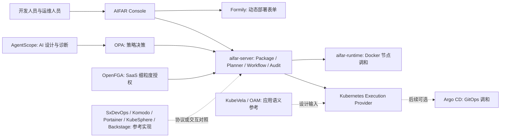
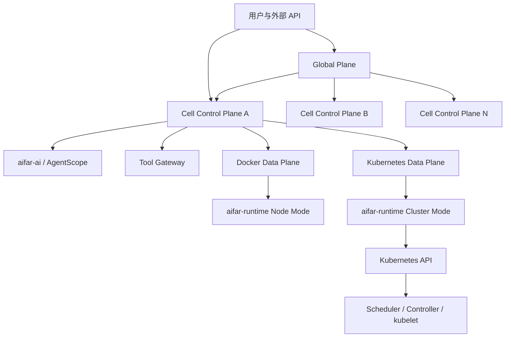
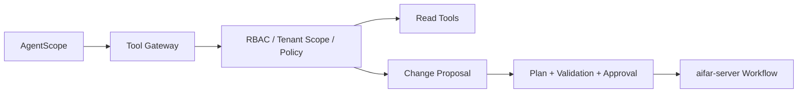

# AIFAR Next 从调研到产品方案过程文档

> 文档状态：评审稿 v1.0
>
> 调研与整理日期：2026-08-15
>
> 适用范围：AIFAR 新一代部署运维平台
>
> 目标读者：产品负责人、架构师、研发、测试、运维、安全与交付人员
>
> 留档位置说明：当前暂存于旧仓库，仅作为新产品需求与决策档案；新产品建立独立仓库后，本文件应作为首批基线文档迁入，不复制旧源码和旧发布历史。

## 1. 文档目的

本文档完整记录 AIFAR 新一代部署运维平台从问题识别、外部调研、方案比较、关键决策到产品架构的过程，解决以下问题：

1. 为什么不继续修补原有代码，而采用全新仓库和全新架构。
2. 如何让平台通过统一应用包支持可模板化描述的各类服务。
3. Docker、Kubernetes、`aifar-runtime`、`aifar-server` 和 AgentScope 分别承担什么职责。
4. 单体、集群、私有化、企业高可用和 SaaS 如何使用同一产品模型。
5. 平台自身如何部署、升级、扩容、容灾和自救。
6. 开发人员、运维人员和 AI 如何共同完成应用包设计、发布和运维。
7. 哪些结论已经确认，哪些是推荐默认值，哪些需要在实施前形成 ADR。

本文档是产品与架构基线，不是详细编码计划。实施前应继续拆分协议、控制面、Runtime、Application Studio、Kubernetes Provider、SaaS Global Plane 等子项目，并为每个子项目编写独立规格和实施计划。

## 2. 执行摘要

AIFAR Next 定位为面向私有化、混合云和 SaaS 的通用部署运维控制面。平台不在核心代码中内置 MySQL、Redis、MinIO、Nacos 等具体服务，而是解释经过签名和验证的 AIFAR Application Package。应用包声明参数、拓扑、执行工作流、模板、探针、动作和动态页面元数据。

产品采用以下顶层架构：

- 一个统一产品模型，不为单体、集群、Docker、Kubernetes、私有化和 SaaS 分叉产品代码。
- Docker 与 Kubernetes 是并列的一级 Execution Provider。
- `aifar-server` 维护全局期望态、计划、调度、工作流、审批、审计和资源模型。
- `aifar-runtime` 是通用执行平面。节点模式管理 Docker 主机；集群模式通过 Kubernetes API 管理平台拥有的资源。
- Kubernetes 中的节点调度、Pod 生命周期和本地自愈交给 Scheduler、Controller 和 kubelet，AIFAR 不重复实现。
- AgentScope 作为 `aifar-ai` 的智能设计、解释和诊断能力，通过受控 Tool Gateway 调用确定性 API，不进入生产调和闭环。
- 私有化单体等价于一个带默认租户的 Cell；企业高可用是同一 Cell 的多副本部署；SaaS 增加 Global Plane 并横向增加多区域 Cell。
- 新产品首期可采用模块化单体交付，但从第一天使用租户边界、独立 PostgreSQL、对象存储接口、无状态 API、可分离 Worker 和 Runtime Gateway。
- 平台安装、升级、备份和故障恢复由独立 `aifar-bootstrap` 承担，避免平台只能依赖自身完成自救。

首个容量基线是单个私有化 Cell 管理约 100 台服务器和 1,000 个服务实例。SaaS Cell 的最终容量不凭经验写死，应通过连接、任务、调和、事件和数据库压测建立容量等级与准入门槛。

## 3. 背景与原系统问题

原 AIFAR Deployment 已具备服务器、任务、审计、应用安装、容器、数据库和存储管理等能力，但其应用逻辑、页面、安装器、资源和状态模型逐步形成较强耦合。继续在原代码上叠加通用应用包、双执行底座、低代码、AgentScope 和 SaaS，会放大以下风险：

- 服务特有逻辑持续进入平台核心代码。
- 页面与部署包不能独立演进。
- 节点执行程序与业务应用生命周期互相影响。
- Docker 任务模型难以自然映射到 Kubernetes Controller 模型。
- SQLite 和单进程状态不适合后续横向扩容及多租户。
- 旧数据迁移、兼容路径和历史发布约束会消耗主要研发能力。

因此已确认：

- 新产品建立全新 GitHub 仓库。
- 不复用旧源码、数据库迁移和发布历史。
- 旧仓库仅作为业务需求、事故经验和验收案例来源。
- 可以保留经过重新定义的业务语义，例如 desired/observed、generation、任务、步骤、目标、审批和审计，但必须重新实现。

## 4. 目标、非目标与约束

### 4.1 产品目标

1. 让开发人员借助 AI 和平台模板创建任意可声明服务的部署包。
2. 让运维人员使用统一页面部署和管理单体、主从、分片和集群。
3. 同时管理 Docker 主机池和 Kubernetes 集群。
4. 支持服务安装、升级、扩缩容、配置、探测、备份、恢复和卸载等生命周期。
5. 支持离线私有化、企业高可用和多租户 SaaS。
6. 使平台自身可安装、升级、扩容、备份和恢复。
7. 通过 AgentScope 提升应用包生成、诊断和解释效率，同时保持生产操作确定性与可审计。

### 4.2 非目标

- 不自行开发容器引擎。
- 不克隆完整 Kubernetes。
- 不把平台建设成任意远程 Shell 或堡垒机替代品。
- 不承诺无需服务知识即可安全扩缩所有有状态服务。
- 不允许部署包携带任意前端代码进入平台页面。
- 不让 AI Agent 直接连接节点、读取明文密钥或绕过审批执行生产变更。
- 首期不建设完整公有云计费、营销和渠道体系，但保留授权、配额和使用计量模型。

### 4.3 已知约束

- 产品负责人熟悉 Docker，但暂不具备大型 Kubernetes 运维能力。
- 需要支持离线 Linux 私有化交付。
- 首期私有化规模约为 100 台服务器、1,000 个服务实例。
- 新服务必须尽量通过应用包接入，而不是修改平台核心代码。
- 用户界面参考阿里云资源控制台的信息架构和工作流，但不复制其专有实现。

## 5. 调研方法与来源

本轮调研采用以下方法：

1. 复盘旧平台的模块边界、安装方式、任务语义、资源页面和历史运维问题。
2. 对比 Kubernetes 节点和控制器模型、阿里云节点执行与多集群管理模型。
3. 调研轻量 Kubernetes、分布式协调、容器引擎、遥测和 AgentScope 的官方资料。
4. 将外部产品能力映射到 AIFAR 约束，而不是直接复制云厂商组件数量。
5. 通过多轮方案讨论逐项确认仓库、容量、租户、应用包、UI、Runtime、Kubernetes 和 SaaS 边界。

### 5.1 Kubernetes 调研结论

Kubernetes 集群由控制面和工作节点组成。kubelet 在每个节点运行，接收 PodSpec，确保其中声明的容器运行且健康，但不管理 Kubernetes 未创建的容器。全局调度、节点状态处理和控制循环分别由 Scheduler、Controller 等控制面组件负责。

对 AIFAR 的启示：

- Runtime 可以借鉴 kubelet 的节点注册、心跳、期望态调和、探针和实际态回报。
- AIFAR Server 与 Runtime 之间必须保持控制面和节点执行面的职责分离。
- 接入 Kubernetes 后，AIFAR 不应再次实现 Pod 调度、kubelet 或容器本地自愈。
- 有状态服务的业务运维知识适合由应用包工作流或 Kubernetes Operator 表达。

来源：

- [Kubernetes Cluster Architecture](https://kubernetes.io/docs/concepts/architecture/)
- [Kubernetes Nodes](https://kubernetes.io/docs/concepts/architecture/nodes/)
- [Kubernetes Controllers](https://kubernetes.io/docs/concepts/architecture/controller/)
- [Kubernetes Operator Pattern](https://kubernetes.io/docs/concepts/extend-kubernetes/operator/)

### 5.2 阿里云调研结论

阿里云公开产品中，与 AIFAR 最相关的设计包括：

- ACK Managed Cluster 将 Kubernetes 控制面作为托管能力，用户主要维护工作负载和必要的数据面资源。
- ACK One 使用统一控制面纳管本地数据中心、第三方云和不同区域的 Kubernetes 集群，并提供 Fleet 级应用分发、监控和流量管理。
- Resource Directory、账号、资源组和标签分别承担组织层级、强隔离、权限分组和多维分类职责。
- Cloud Assistant Agent 提供批量命令、文件上传、参数化命令、公共命令和插件，但每次动作由控制面明确发起。

对 AIFAR 的启示：

- 采用 Global Plane、Cell Control Plane 和客户 Data Plane 分层。
- 统一纳管客户自建、平台托管、Docker 和 Kubernetes 环境。
- 组织、租户、环境、资源组和标签分层建模。
- Runtime 吸收受控命令与文件交付能力，但不开放无约束 Shell。

来源：

- [Alibaba Cloud ACK Overview](https://www.alibabacloud.com/help/en/ack/ack-managed-and-ack-dedicated/product-overview/what-is-ack)
- [Alibaba Cloud ACK One Overview](https://www.alibabacloud.com/help/en/ack/distributed-cloud-container-platform-for-kubernetes/product-overview/ack-one-overview)
- [Alibaba Cloud Resource Management Scenarios](https://www.alibabacloud.com/help/en/resource-management/product-overview/scenarios)
- [Alibaba Cloud Resource Directory, Resource Group and Tag](https://www.alibabacloud.com/help/en/resource-management/product-overview/differences-and-relationships-among-the-resource-directory-resource-group-and-tag-services)
- [Alibaba Cloud Cloud Assistant Overview](https://www.alibabacloud.com/help/en/ecs/user-guide/overview-10)

### 5.3 K3s 调研结论

K3s 提供 server 和 agent 两类节点。单 server 可使用嵌入式数据库；高可用可以使用三个及以上 server 搭配嵌入式 etcd，或多个 server 搭配外部数据库。

对 AIFAR 的启示：

- K3s 适合作为首个经过 AIFAR 认证和托管的 Kubernetes 发行版。
- 单体体验和高可用拓扑都可以使用同一 Kubernetes API。
- K3s 仍然需要处理网络、存储、证书、升级、备份和灾难恢复，不能宣传为零运维。
- AIFAR 应同时支持导入标准 Kubernetes，避免产品锁定在 K3s。

来源：[K3s Architecture](https://docs.k3s.io/architecture)

### 5.4 etcd 调研结论

etcd 是强一致、持久化的分布式 KV，提供 KV、Watch、Lease 等 API，适合配置、元数据和分布式协调。它不能操作 Docker、执行应用工作流或替代节点 Runtime。

对 AIFAR 的启示：

- 私有化单 Cell 的 AIFAR 业务数据库不应使用 etcd 代替 PostgreSQL。
- 首期不单独为 AIFAR Server 部署 etcd。
- K3s HA 使用嵌入式 etcd 时，etcd 属于 Kubernetes 基础设施。
- 未来多副本 Reconciler 若需要协调，优先评估 PostgreSQL 租约与 fencing；只有明确需要更强协调语义时再引入独立 etcd。

来源：

- [etcd API Guarantees](https://etcd.io/docs/v3.6/learning/api_guarantees/)
- [Why etcd](https://etcd.io/docs/v3.6/learning/why/)

### 5.5 Docker 与 OpenTelemetry 调研结论

Docker Engine 由长期运行的 daemon、API 和 CLI 构成，daemon 管理镜像、容器、网络和卷。AIFAR Runtime 应优先使用稳定 API，而不是把 Docker CLI 文本输出作为核心协议。

OpenTelemetry Collector 支持接收、处理和导出 traces、metrics、logs，并支持 Agent、Gateway 以及 Agent-to-Gateway 部署模式。AIFAR 可以复用它完成遥测管道，避免自研通用采集器。

来源：

- [Docker Engine](https://docs.docker.com/engine/)
- [OpenTelemetry Collector](https://opentelemetry.io/docs/collector/)

### 5.6 AgentScope 调研结论

AgentScope 提供 ReAct Agent、工具、MCP、Agent Skill、会话与状态、多 Agent 工作流、Tracing 和 Evaluation 等能力。

对 AIFAR 的启示：

- AgentScope 适合应用包生成、解释、诊断、知识检索和操作建议。
- AI 输出必须经过 Schema 校验、静态策略、模拟执行和人工审批。
- AgentScope 不应替代任务引擎、调和器、Scheduler 或 Runtime。
- AI 工具调用必须通过 Tool Gateway 执行 RBAC、租户范围、脱敏、审批和审计。

来源：

- [AgentScope Documentation](https://doc.agentscope.io/)
- [AgentScope GitHub](https://github.com/agentscope-ai/agentscope)

### 5.7 SxDevOps 开源参考实现评估

2026-08-16 评估 [aiyiyi121/sxdevops](https://github.com/aiyiyi121/sxdevops)。该项目是面向监控、告警、任务和容器运维的 AI 运维平台，已实现 MCP、Skill、预检、待确认操作、RBAC、审计、结构化证据和二阶段应答等链路。其核心原则“模型负责理解和规划，平台负责权限、确认、执行与审计”与本方案的 `aifar-ai -> Tool Gateway -> aifar-server` 边界一致。

本项目将它定位为 AI 运维治理层的参考实现，不是 AIFAR Next 的基座、依赖项或可直接 fork 的代码来源。

可吸收并重新设计为 AIFAR 自有契约的内容：

- `ActionDefinition`：AI 可申请的受控动作、风险等级、所需角色和参数 Schema。
- `PreflightResult`：权限、租户范围、资源归属、目标健康度、影响范围和停止条件的预检结果。
- `EvidenceBundle`：告警、指标、日志、资源状态和诊断结论的脱敏结构化证据。
- `PendingAction`：审批前冻结动作、目标、参数摘要和预检快照，审批后重新校验，防止参数漂移。
- `ToolExecutionAudit`：关联人员、模型、工具、策略版本、审批、任务和结果的完整审计链。

不继承的实现边界：

- 不采用其 Django/MySQL/Redis 单体和单机 Compose 部署模型；AIFAR 仍遵循 Global Plane + Cell、PostgreSQL、对象存储、事务 Outbox 与可分离 Worker/Runtime Gateway。
- 不采用 SSH 直接命令作为生产执行主通道，也不沿用其凭据存储方式；节点变更必须通过 `aifar-runtime` 或 Kubernetes Execution Provider，并使用短期凭据、mTLS 和最小权限。
- 不将 Kubernetes 仅实现为一次性任务操作；AIFAR 必须具有 Package 渲染、期望态、实际态、调和和 Provider 契约。
- 不把自定义 AIOps Agent 替代 AgentScope；AIFAR 使用 AgentScope 编排 AI 能力，所有工具仍经 Tool Gateway 受控调用。
- 不把该项目当作多租户实现参考；AIFAR 的所有资源、事件、对象路径和权限从第一天纳入 `tenant_id`、`resource_group_id` 和 `cell_id` 边界。

若未来复用其 Apache-2.0 代码，必须建立第三方来源清单，保留许可证与 NOTICE、标记修改、完成凭据与权限安全审查，并以 AIFAR 的协议测试和威胁模型验收后方可进入产品代码。

### 5.8 外部组件与参考实现能力矩阵

下表中的“引入”分为三类：`候选依赖` 表示可通过 PoC 后作为产品组件使用；`协议参考` 表示学习模型、样例和测试，不将其安装为平台核心；`产品参考` 表示只借鉴资源工作流和交互。所有第三方代码复用均需分别完成许可证、供应链和安全审查。

| 组件或项目 | 能力 | 在 AIFAR 中的接入位置 | 引入决策与阶段 | 不替代的能力或边界 |
|---|---|---|---|---|
| [Formily](https://github.com/alibaba/formily) | JSON Schema 表单渲染、字段联动、校验、表单构建器 | Application Studio、应用包部署向导、配置编辑页 | 候选依赖；阶段 0 验证 React + Ant Design 集成，阶段 1 通过后使用 | 只渲染平台白名单 UI Schema；不执行包内 JavaScript，不定义应用生命周期 |
| [Open Policy Agent](https://github.com/open-policy-agent/opa) | 声明式策略判断；可判断授权、环境准入、风险级别、审批和标签规则 | Tool Gateway、Package Admission、Planner、Approval Policy | 候选依赖；阶段 0 完成策略 PoC，阶段 1 视结果嵌入或独立部署 | 不保存身份关系，不执行任务，不替代审计和工作流 |
| [KubeVela](https://github.com/kubevela/kubevela) / OAM | 应用组件、Trait、Workflow、交付策略与多集群应用语义 | Kubernetes Application Package Renderer、Package SDK、Provider 契约 | 协议参考；阶段 0 映射语义和认证包，阶段 2 再评估集成 | 不在首期 Cell 内安装为第二套控制面；Docker 场景仍由 AIFAR Package/Runtime 管理 |
| [AgentScope](https://github.com/agentscope-ai/agentscope) | Agent、MCP、Skill、会话、多 Agent 工作流、Tracing、Evaluation | `aifar-ai`，用于包草案生成、解释、只读诊断和受控变更建议 | 候选依赖；阶段 0 只读诊断 PoC，阶段 1 引入生成和解释 | 不直接连接 Runtime，不读取明文凭据，不绕过 Tool Gateway、策略或审批 |
| [SxDevOps](https://github.com/aiyiyi121/sxdevops) | MCP/Skill 编排、预检、结构化证据、待确认操作、二阶段回答、审计 | AI 运维治理契约：`ActionDefinition`、`PreflightResult`、`EvidenceBundle`、`PendingAction`、`ToolExecutionAudit` | 协议与产品参考；阶段 0 按 AIFAR 模型重建 PoC | 不作为 AIFAR 基座或 AgentScope 替代，不继承其单体、SSH 直连和凭据模型 |
| [Komodo](https://github.com/moghtech/komodo) | Control Plane + Periphery 节点执行、服务器接入、Stack/资源模型、升级体验 | `aifar-server` 与 `aifar-runtime` 的注册、下发、状态回报和安装体验参考 | 只读协议与产品参考；阶段 1 用于 Runtime 行为对照 | GPL-3.0，禁止复制或链接其源码；不采用其自由命令和 Compose-only 模型 |
| [Portainer](https://github.com/portainer/portainer) | Docker/Kubernetes 环境接入、资源浏览、日志、生命周期操作与安全初始化 | 统一资源中心、节点/环境接入、Docker 资源详情与操作交互 | 产品参考；阶段 1 设计评审时对照 | 不替代 Package、Planner、Runtime 或租户 Cell；不按其产品模型扩展核心 |
| [Argo CD](https://github.com/argoproj/argo-cd) | GitOps 同步、漂移检测、Kubernetes 应用状态和审计 | Kubernetes GitOps Execution Provider，可接收 AIFAR 渲染的声明式产物 | 后续可选 Provider；阶段 2 仅在客户需要 GitOps 时接入 | 不管理 Docker 主机，不定义 AIFAR 应用包，不替代审批和业务工作流 |
| [OpenFGA](https://github.com/openfga/openfga) | 基于关系元组的细粒度授权，例如租户、资源组、应用、环境和操作之间的授权关系 | Global Plane/Cell 的授权服务与 Tool Gateway 授权查询 | SaaS 阶段候选；先保留授权抽象，规模和授权复杂度达到阈值后 PoC | 不承担策略判断、身份认证、租户数据隔离或审计 |
| [KubeSphere](https://github.com/kubesphere/kubesphere) | 多租户 Kubernetes 控制台、工作空间、资源页签、应用商店、多集群视图 | 阿里云风格统一资源中心、租户资源工作台的信息架构参考 | 产品参考；阶段 1 UI 设计评审与阶段 2 多集群设计对照 | 不作为基础平台或微服务模板；不复制其完整 Kubernetes 发行版与扩展体系 |
| [Backstage](https://github.com/backstage/backstage) | 软件目录、模板、自助开发者入口、插件化开发者门户 | 未来 Application Studio 的开发者目录、认证包目录、文档入口 | 后续产品参考；不进入首期控制面 | 不替代应用包、部署页面、资源控制台或运维工作流 |

组件关系如下：



首期实际落地组合是 `aifar-server`、`aifar-runtime`、Formily、AgentScope 和 OPA PoC。KubeVela、SxDevOps、Komodo、Portainer、KubeSphere 与 Backstage 不作为首期运行依赖；Argo CD 和 OpenFGA 在 Kubernetes GitOps 与 SaaS 条件成熟后再进入认证流程。

## 6. 方案演进与决策记录

本节保留决策变化，避免后续只看到最终图而不知道约束来源。

| 阶段 | 原始问题或方案 | 触发原因 | 当前结论 | 状态 |
|---|---|---|---|---|
| 仓库 | 在旧代码上继续重构 | 旧代码耦合且迁移成本高 | 新建独立仓库，代码零复用 | 已确认 |
| 运行底座 | Docker-first，未来再加 K8s | 团队更熟悉 Docker | Docker/Kubernetes 从协议第一天并列，交付分阶段 | 已修正并确认方向 |
| 控制面 | 单控制面可恢复 | 首期规模约 100 节点/1,000 实例 | 首期仍可单体，但组件和数据从第一天支持 Cell 扩容与 HA | 已修正并确认 |
| 租户 | 私有化单企业、多用户 | 首期不做公有 SaaS | 私有化单体是默认租户 Cell；模型从第一天支持 SaaS Global Plane | 已修正并确认 |
| 部署入口 | 每种服务定制安装器和页面 | 无法覆盖持续增加的服务 | 一个应用包协议、一个部署入口、拓扑 Profile | 已确认 |
| 应用设计 | 低代码或源码编辑二选一 | 开发者和运维诉求不同 | Application Studio 同时保留三栏可视化与 Schema IDE | 已确认 |
| 页面扩展 | 部署包提供自定义页面 | 任意前端代码带来安全和兼容风险 | 平台渲染白名单 UI Schema，不运行包内前端代码 | 已确认 |
| 资源页面 | 按数据库、存储、中间件写死菜单 | 新服务需要改平台 | 统一资源中心和能力驱动标准页签 | 已确认 |
| 节点 Agent | 与 AI Agent 同名 | 概念混淆 | 节点组件命名 `aifar-runtime`，AI 服务命名 `aifar-ai` | 已确认 |
| Runtime | 自研完整节点系统 | 重复开发容器和遥测能力 | 薄适配层，复用 Docker/containerd/OTel | 已确认 |
| Kubernetes 接入 | Runtime 模拟 kubelet | 会与 K8s 控制器重复调和 | K8s Provider 调用 API，Pod 调度和自愈交给 K8s | 已确认 |
| 平台升级 | 平台自行升级自身 | 控制面故障时形成循环依赖 | 独立 `aifar-bootstrap` / Operator | 推荐基线 |
| SaaS 隔离 | 所有租户共用一套资源 | 有噪声邻居与合规风险 | 池化、独立数据库、专属 Cell、私有化四级隔离 | 推荐默认值，待业务确认 |

## 7. 方案比较

### 7.1 继续旧系统、彻底微服务化、模块化单体

| 方案 | 优点 | 缺点 | 结论 |
|---|---|---|---|
| 继续旧系统 | 短期可复用功能 | 继承耦合、迁移和兼容包袱 | 不采用 |
| 首日完整微服务 | 独立扩容边界明显 | 交付、调试和私有化运维复杂 | 不采用 |
| 模块化单体，接口可拆分 | 首期简单，后续可分离热点组件 | 需要严格模块边界 | 采用 |

模块化单体不是把所有代码写入一个大模块，而是 API、Package、Planner、Workflow、Reconciler、Audit、Runtime Gateway 等保持独立包、接口和数据所有权；首期允许同进程运行，扩容时按进程角色拆分。

### 7.2 Docker-only、Kubernetes-only、双执行底座

| 方案 | 优点 | 缺点 | 结论 |
|---|---|---|---|
| Docker-only | 学习和交付成本低 | 后续协议和调度模型可能重构 | 不采用 |
| Kubernetes-only | 调度和自愈能力成熟 | 单机客户和离线交付门槛高 | 不采用 |
| Docker + Kubernetes | 兼顾简单交付和长期能力 | 应用包需维护双渲染器 | 采用 |

### 7.3 单大集群 SaaS、每租户独占、Cell 分级模型

| 方案 | 优点 | 缺点 | 结论 |
|---|---|---|---|
| 单大集群池化 | 成本最低 | 故障域和噪声邻居过大 | 不采用 |
| 每租户全独占 | 隔离最强 | 成本和交付负担高 | 作为高阶规格 |
| Global Plane + 多 Cell | 可分级隔离并限制故障域 | 需要 Cell 路由和迁移能力 | 采用 |

## 8. 产品定位与用户角色

### 8.1 产品定位

AIFAR Next 是一个以应用包为扩展单元、以声明式期望态为运行模型、同时管理 Docker 与 Kubernetes 的部署运维控制面。产品面向：

- 离线或内网私有化客户。
- 需要统一管理多服务器、多集群和多环境的企业。
- 需要由平台团队集中提供服务模板的开发组织。
- 未来由厂商运营的多租户 SaaS。

### 8.2 用户角色

| 角色 | 主要职责 |
|---|---|
| 平台管理员 | 组织、租户、Cell、运行环境、认证、策略和平台升级 |
| 应用开发者 | 设计应用包、Schema、模板、工作流、探针和测试 |
| 运维人员 | 部署、扩缩容、升级、备份、恢复和故障处理 |
| 审批人员 | 审核高风险计划、变更窗口和回滚方案 |
| 审计人员 | 读取操作证据、审批链、日志和合规报告 |
| AI 助手 | 生成草案、解释差异、诊断问题和提出建议，不独立授权 |

## 9. 顶层架构



### 9.1 Global Plane

仅 SaaS、集团多区域或集中运营版本启用，职责包括：

- 组织与租户目录。
- 全局身份联合和登录入口。
- 产品授权、套餐、配额和使用计量。
- Cell 注册、健康、容量和租户放置。
- 全局应用包目录和签名信任根。
- 全局审计索引，不默认复制客户敏感操作内容。
- 租户到 Cell 的路由和迁移编排。

Global Plane 不直接执行客户节点命令，也不成为所有 Runtime 长连接的单点。

### 9.2 Cell Control Plane

每个 Cell 是独立扩容和故障隔离单元，包含：

- API/UI Gateway。
- Identity Context 与租户范围校验。
- Resource、Environment 和 Application Package 服务。
- Planner、Scheduler、Workflow 和 Reconciler。
- Runtime Gateway 与 Kubernetes Provider。
- Task、Event、Audit 和 Notification。
- PostgreSQL、对象存储和可选缓存/消息适配器。
- 监控、日志和追踪接入。

### 9.3 Customer Data Plane

客户数据面可以是：

- 裸机或虚拟机组成的 Docker Host Pool。
- AIFAR 托管 K3s 集群。
- 客户导入的标准 Kubernetes 集群。
- 同一租户下的多个环境和多个集群。

Runtime 或 Cluster Connector 只主动出站连接所属 Cell，默认不要求公网入站管理端口。

## 10. 核心资源模型

资源层级参考阿里云 Resource Directory、账号、资源组和标签思想，但使用 AIFAR 自有语义：

```text
Global Plane
└── Organization
    └── Tenant
        ├── Environment: dev / test / staging / prod
        └── Resource Group
            ├── Host Pool
            ├── Kubernetes Cluster
            ├── Application Instance
            ├── Service Component
            └── Task / Policy / Secret Reference
```

每个资源至少包含：

- 全局唯一且不可复用的资源 ID。
- `organization_id`、`tenant_id`、`cell_id`。
- `environment_id`、`resource_group_id`。
- `spec`、`status`、`generation`、`observed_generation`。
- owner reference、labels、annotations。
- 创建者、更新时间、版本和删除策略。

数据库唯一索引、查询条件、对象存储路径、任务队列分区、缓存键、事件主题和审计记录必须包含租户边界。禁止仅依赖前端传入租户 ID 做隔离。

## 11. AIFAR Application Package

### 11.1 定位

应用包是平台扩展业务服务的唯一正式单元。平台核心只解释协议，不包含具体产品安装分支。

“支持所有服务”的准确边界是：支持所有能够通过参数、模板、制品、探针和受控工作流描述的服务。无法以可重复、可校验流程表达的人工操作，不应宣称已被平台自动化支持。

### 11.2 建议目录

```text
application-package/
├── manifest.yaml
├── schemas/
│   ├── parameters.schema.json
│   ├── topology.schema.json
│   ├── ui.schema.json
│   ├── status.schema.json
│   └── actions.schema.json
├── renderers/
│   ├── docker/
│   │   └── compose.yaml.tpl
│   └── kubernetes/
│       ├── deployment.yaml.tpl
│       ├── statefulset.yaml.tpl
│       └── service.yaml.tpl
├── workflows/
│   ├── install.yaml
│   ├── upgrade.yaml
│   ├── scale.yaml
│   ├── backup.yaml
│   ├── restore.yaml
│   └── uninstall.yaml
├── probes/
├── policies/
├── assets/
├── tests/
└── signatures/
```

### 11.3 拓扑 Profile

统一应用包通过拓扑 Profile 表达：

- standalone。
- primary-replica。
- sentinel。
- sharded。
- distributed。
- kubernetes-native。

拓扑 Profile 声明组件、角色、数量约束、反亲和、端口、存储、依赖和允许动作。单体和集群仍进入同一个创建应用流程，只展示不同参数。

### 11.4 工作流语义

工作流必须使用平台定义的类型化原子动作，不允许 API 直接接收自由 Shell。典型动作包括：

- 制品校验与分发。
- 模板渲染。
- 容器或 Kubernetes 资源应用。
- HTTP、TCP、SQL、进程和集群角色探测。
- 等待条件。
- 成员加入与退出。
- 流量摘除与恢复。
- 备份、恢复和校验。
- 人工审批与暂停点。

Shell 只能作为受限 Runner 内的兼容动作：必须随签名应用包发布，声明执行用户、参数类型、工作目录、超时、资源限制、允许访问的 Secret 和脱敏规则。

### 11.5 发布治理

- Schema 是单一真源。
- 发布版本不可原地修改。
- 包、制品和依赖生成完整 SBOM 与 SHA-256 清单。
- 发布包必须签名并验证信任链。
- AI 生成内容必须经过 lint、Schema、策略、渲染、模拟和测试环境验收。
- 生产环境只能安装已发布并满足环境策略的版本。

## 12. Application Studio

Application Studio 面向应用开发者，采用已经确认的 B+C 混合设计：

- 三栏低代码模式：左侧结构树、中间画布、右侧属性与约束。
- Schema IDE：源码、自动补全、Schema 文档、错误定位。
- 双向同步：可视化与源码编辑同一份结构化模型。
- Diff：比较草稿、已发布版本和目标环境实例。
- Test：Schema、渲染、工作流、探针和升级路径测试。
- Preview：实时预览部署页面和资源详情页。
- AI：根据官方安装文档和模板生成草案，解释错误并补充测试。

运维角色默认看不到源码编辑器，只使用已经发布的应用包。

## 13. 动态部署与资源控制台

### 13.1 创建应用

采用阿里云式全页创建流程，平台固定：

1. 基本信息。
2. 租户、环境和资源组。
3. 应用包与版本。
4. 运行底座与目标资源。
5. 拓扑与容量。
6. 动态参数。
7. 预检。
8. 执行计划、影响范围和回滚说明。
9. 风险确认与审批。
10. 创建任务并跳转进度页。

应用包只能在固定壳层内通过白名单 UI Schema 控制字段、分组、联动、帮助、校验和显示条件。

### 13.2 统一资源中心

左侧菜单不写死数据库、存储和中间件。所有实例进入统一资源中心，通过资源类型、应用、环境、资源组、状态和标签过滤。

资源详情页使用稳定页签：

- 概览。
- 资源与拓扑。
- 监控。
- 配置。
- 访问与安全。
- 数据保护。
- 日志。
- 任务与事件。

包可以在标准页签内部声明模块，不能创建任意顶级路由。单体实例隐藏无意义的拓扑层级；集群实例按组件、角色和成员聚合。

## 14. aifar-server 与扩缩容

Server 是唯一全局决策者：

- 保存期望态。
- 校验配额、拓扑和策略。
- Planner 生成不可变执行计划。
- Scheduler 选择 Docker 节点或 Kubernetes 集群。
- Workflow 编排跨节点步骤。
- Reconciler 比较 desired 与 observed。
- 生成任务、步骤、目标、事件、审批和审计。

扩缩容统一采用：

```text
用户或策略提出容量变化
  -> 包策略校验
  -> Planner 生成步骤和影响
  -> 审批
  -> Execution Provider 执行
  -> 探针验证
  -> observedGeneration 收敛
```

无状态服务可以使用通用副本数策略。有状态服务必须由应用包声明加入、同步、切流、退出、再平衡和回滚顺序。不能用简单增加容器数量代替数据库或分布式存储扩容。

## 15. aifar-runtime 能力边界

### 15.1 对标关系

`aifar-runtime` 的核心语义对标 kubelet，受控运维体验参考 Cloud Assistant Agent，并增加 AIFAR 应用包执行协议。

| 能力 | kubelet | Cloud Assistant | aifar-runtime |
|---|---|---|---|
| 节点注册与心跳 | 强 | 有在线状态 | mTLS 注册、能力和容量上报 |
| 持续期望态调和 | 强 | 非核心 | 强，仅管理 AIFAR 所有资源 |
| 容器生命周期 | 通过 CRI | 通常脚本调用 | Docker Provider 调用 Engine API |
| 命令与文件 | 非通用主机通道 | 强 | 仅签名包和类型化受控动作 |
| 健康探测 | Pod 探针 | 命令结果 | 包定义服务、角色和集群探针 |
| 跨节点调度 | 不负责 | 云端批量下发 | 不负责，由 Server/K8s 负责 |
| 自升级 | 节点体系负责 | 支持 Agent 管理 | 签名升级、灰度、失败回滚 |
| 应用业务知识 | 无 | 脚本承载 | 应用包承载，不编译进 Runtime |

### 15.2 Node Mode

作为 systemd 服务运行在 Docker 主机：

- 主动建立 mTLS gRPC 长连接。
- 接收不可变 Assignment。
- 校验 generation、签名、策略和制品哈希。
- 管理 AIFAR 标记的镜像、容器、网络和卷。
- 执行受限 Runner 动作。
- 保存必要的本地期望态和执行日志。
- 断线时保持已运行服务，不自行发起全局变更。
- 重连后汇报实际态并处理新 generation。

### 15.3 Kubernetes Mode

作为集群内 Deployment/Controller 或受控 Connector 运行：

- 使用最小权限 ServiceAccount 访问 Kubernetes API。
- 创建和管理带 AIFAR owner/label 的资源。
- 映射 Deployment、StatefulSet、DaemonSet、Job、Service、Ingress/Gateway、ConfigMap、Secret Reference、PVC、HPA 和 PDB 等对象。
- 监听资源状态并汇总给 Cell。
- 不直接操作每个节点的 containerd。
- 不替代 Scheduler、Controller Manager 或 kubelet。

## 16. Kubernetes 策略

### 16.1 支持范围

- AIFAR 托管 K3s：首个认证发行版。
- 标准 Kubernetes 导入：通过兼容检查和最小权限连接。
- 未来可以增加 RKE2、ACK、EKS、AKS 等 Provider，不改变应用包顶层协议。

### 16.2 K3s 生命周期

`aifar-bootstrap` 负责：

- 主机预检。
- 单 server 或 HA server 拓扑安装。
- 固定注册地址、证书和 token 管理。
- 网络、存储、Ingress、Metrics、日志等认证组件安装。
- etcd 或外部数据库备份。
- cordon、drain、滚动升级和回滚。
- 控制面不可用时的离线恢复。

### 16.3 所有权边界

AIFAR 只管理自身创建或明确接管的 Kubernetes 资源。导入集群中的第三方资源默认只读发现，不自动删除、重建或改写。

## 17. AgentScope 与 aifar-ai

### 17.1 能力

- 从产品文档生成应用包草案。
- 生成参数、拓扑、UI、工作流、探针和测试。
- 解释执行计划、差异和风险。
- 聚合日志、事件、配置和监控进行诊断。
- 生成处理建议、变更草案和复盘报告。
- 通过 Evaluation 验证提示、工具选择和输出稳定性。

### 17.2 安全边界



- AgentScope 不直接连接 Runtime。
- AgentScope 不读取明文 SSH、数据库或对象存储凭据。
- 读取工具默认返回脱敏、限量和租户范围内的数据。
- 所有变更先形成 Change Proposal，不能直接形成节点命令。
- 高风险操作必须人工审批。
- AI 的输入、工具调用、输出、审批和最终任务形成关联审计链。

## 18. 平台自身部署方式

同一发布版本提供四个 Profile：

| Profile | 交付方式 | 适用场景 | 可用性 |
|---|---|---|---|
| development | 本地进程或 Compose | 开发测试 | 不承诺 HA |
| standalone | Docker Compose 单 Cell | 小型私有化 | 单点可备份恢复 |
| ha | Helm + AIFAR 托管 K3s | 企业私有化 | 多副本和数据库 HA |
| saas-global / saas-cell | 托管 Kubernetes | SaaS | 多 Cell、多区域和分级隔离 |

发布包包含：

- `aifar-bootstrap`。
- Compose 模板。
- Helm Chart。
- 容器镜像和离线镜像包。
- 数据库迁移。
- 默认策略和应用包信任根。
- SBOM、签名和校验清单。
- 备份、恢复和验收工具。

### 18.1 Standalone

- 单个模块化 `aifar-server` 实例。
- 单独 PostgreSQL 容器，不使用 SQLite。
- 兼容 S3 的对象存储；小型环境可由安装包提供单实例 MinIO。
- PostgreSQL 持久任务队列与事务 Outbox，避免首期强制部署复杂 MQ。
- API、Worker、Reconciler、Gateway 可以同进程不同角色运行。
- 默认创建一个 Organization、Tenant、Environment 和 Resource Group。

### 18.2 Enterprise HA

- 至少两个 API/Gateway 副本。
- Worker 根据任务积压横向扩容。
- Reconciler 按租户或资源哈希分片，并使用租约和 fencing 防止双执行。
- PostgreSQL 使用经过认证的 HA 方案。
- 对象存储使用外部高可用服务或认证分布式拓扑。
- 平台 K3s 与客户业务集群原则上分离。

### 18.3 SaaS

- Global Plane 只保存全局目录、授权、Cell 路由和聚合索引。
- 每个 Cell 保存其租户的完整资源、任务和审计数据。
- Runtime 直接连接租户所属 Cell，不经 Global Plane 转发长连接。
- 新租户由 Placement Policy 选择区域、Cell 和隔离等级。
- Cell 达到准入阈值时停止接收新租户并创建新 Cell。
- 支持租户冻结、导出、迁移、校验和切换路由。

## 19. SaaS 租户隔离模型

推荐四级模型：

| 等级 | 计算 | 数据库 | 对象与密钥 | 适用对象 |
|---|---|---|---|---|
| Standard | 共享 Cell | 共享集群与 Schema，强制 tenant_id/RLS | 独立前缀与租户 DEK | 普通租户 |
| Enterprise | 共享 Cell | 独立数据库 | 独立 bucket/prefix 与租户密钥 | 中大型客户 |
| Dedicated Cell | 独立 Cell | 独立数据库集群 | 独立存储与密钥域 | 强隔离与合规客户 |
| Private | 客户独立部署 | 客户独立 | 客户独立 | 离线私有化 |

租户升级隔离等级时保持资源 ID 和 Runtime 协议不变。迁移采用导出快照、增量冻结、目标校验、Runtime 端点切换和回滚窗口，不通过手工修改数据库完成。

该四级模型是当前推荐默认值，尚需产品负责人确认套餐与商业边界；技术模型应从第一天保留。

## 20. 平台横向扩容模型

| 组件 | 主要压力指标 | 扩容方式 |
|---|---|---|
| API/UI | RPS、P95 延迟、CPU | 无状态副本 |
| Runtime Gateway | 活跃连接、消息吞吐 | 按 runtime_id 一致性分片 |
| Workflow Worker | 队列深度、任务等待时间 | 增加消费者 |
| Reconciler | 资源数、调和延迟 | 按 tenant/resource 哈希分片 |
| Telemetry | 接收速率、导出延迟 | OTel Agent/Gateway 分层扩容 |
| PostgreSQL | QPS、连接、WAL、容量 | HA、只读副本、Cell 拆分 |
| Object Storage | 容量、吞吐 | 外部或分布式扩容 |
| Cell | 租户数、连接数、任务和数据库综合水位 | 增加 Cell |

扩容必须配套：

- 容量等级和准入控制。
- 限流、租户配额和公平队列。
- 背压和批量事件处理。
- 幂等键、租约、fencing token 和去重。
- Runtime 重连抖动控制。
- Cell 级熔断和降级。

## 21. 数据与基础设施建议

### 21.1 推荐技术基线

| 层 | 推荐基线 | 理由 |
|---|---|---|
| Server/Runtime/Bootstrap | Go | 单二进制、并发、跨平台和运维友好 |
| API | REST/OpenAPI + gRPC | 用户 API 与内部流式协议分离 |
| Runtime 协议 | Protobuf + mTLS gRPC stream | 版本化、双向流和强类型 |
| 主数据库 | PostgreSQL | 事务、JSON、RLS、HA 和 SaaS 演进 |
| 对象存储 | S3 接口 | 私有 MinIO 与云对象存储兼容 |
| 首期任务队列 | PostgreSQL durable queue + Outbox | 降低单体部署组件数量 |
| 遥测 | OpenTelemetry | 标准化 traces、metrics、logs 管道 |
| AI 服务 | Python + AgentScope | 采用官方生态并与确定性控制面隔离 |
| 前端 | React + TypeScript + Ant Design/Formily | 更贴近阿里系控制台和 Schema 表单生态 |

前端技术栈是推荐默认值，正式落地前应通过 Application Studio、动态表单、大型资源表格和国际化 PoC 验证。

### 21.2 数据原则

- PostgreSQL 是资源、任务和审计的权威存储。
- 对象存储保存应用包、制品、长日志、诊断包和备份清单。
- Metrics/Logs 后端是可替换适配器，不把监控明细塞入主业务表。
- Secret 只保存加密值或外部 Secret Reference。
- 所有跨模块事件使用事务 Outbox，避免数据库成功但事件丢失。
- 数据库迁移采用 expand-contract，保证滚动升级期间新旧版本兼容。

## 22. 安全与供应链

### 22.1 身份与权限

- 用户支持本地账号和 OIDC/SAML 企业身份源。
- Runtime 使用独立设备身份、短期证书和证书轮换。
- Kubernetes 使用最小权限 ServiceAccount。
- 权限同时校验角色、租户、环境、资源组、动作和条件。
- 生产变更支持双人审批、变更窗口和 break-glass 审计。

### 22.2 凭据与密钥

- 不在日志、任务参数和 AI 上下文中暴露明文密钥。
- SaaS 使用租户级数据加密密钥并支持轮换。
- Runtime 只在执行时获得最小范围、短时有效 Secret。
- 应用包使用 Secret Reference，不允许将凭据写入模板默认值。

### 22.3 制品安全

- 应用包、Runtime、Bootstrap、镜像和离线资源全部签名。
- 安装前执行 SHA-256、签名、SBOM、兼容性和策略检查。
- 哈希不匹配时提示并停止，不自动上传或执行。
- 包发布记录生成者、来源、测试结果、审批和签名主体。

## 23. 可靠性、备份与灾难恢复

### 23.1 Standalone

- 明确 RPO/RTO，不伪装为 HA。
- 定时备份 PostgreSQL、对象存储清单、加密密钥材料和平台配置。
- 恢复演练必须在隔离环境完成。
- Runtime 在控制面不可用时保持已运行服务，不接受新全局变更。

### 23.2 Enterprise HA

- K3s 控制面、PostgreSQL、对象存储和入口分别定义 HA 和备份策略。
- 平台升级前自动预检和生成恢复点。
- Runtime Gateway 故障时客户端使用端点列表重连。
- Reconciler 接管必须带 fencing，不能仅依赖过期锁。

### 23.3 SaaS

- Cell 是主要故障域，Global Plane 故障不影响已登录 Cell 的运行任务。
- Global Plane 与 Cell 分别备份。
- 支持 Cell 内恢复、同区域替换和跨区域租户恢复。
- 专属 Cell 可以定义独立 RPO/RTO 和维护窗口。

## 24. 平台升级与兼容

- `aifar-bootstrap` 负责平台安装、升级、备份、恢复和回滚。
- Runtime、Server、Package Protocol 和应用包各自独立版本化。
- Server 至少兼容当前和前一个 Runtime 协议窗口。
- Runtime 自升级先灰度到测试节点，再按资源组分批。
- 数据库迁移必须支持滚动升级，破坏性收缩延后到旧版本退出后。
- 已发布应用包不可变；升级通过新版本和明确迁移工作流完成。
- Kubernetes 资源变更使用 server-side apply 或等价所有权机制，检测字段冲突。

## 25. 可观测性与运营

平台至少提供：

- 请求、任务、工作流、Runtime Assignment 和 Kubernetes 资源的统一 trace ID。
- Runtime 在线率、心跳延迟、重连次数和 Assignment 延迟。
- 任务成功率、排队时间、执行时间、重试和回滚率。
- Reconciler 收敛时间和 generation 积压。
- Cell 租户数、资源数、连接数、数据库水位和对象存储容量。
- 应用实例、组件、节点和集群角色的能力驱动指标。
- SaaS 每租户用量、配额、限流和成本归属数据。

告警与自动修复分开：告警可以自动生成诊断和变更建议，生产修复仍必须遵守策略与审批。

## 26. 测试与验收策略

### 26.1 Application Package

- Schema 正反例测试。
- Docker 与 Kubernetes 渲染快照测试。
- 单体和各集群拓扑约束测试。
- 安装、升级、扩容、缩容、备份、恢复和卸载工作流测试。
- 故障注入、重试、补偿和幂等测试。
- 签名、篡改和 Secret 泄露测试。

### 26.2 Runtime

- 断网、重连、重复 Assignment、乱序 generation。
- Runtime 重启和本地状态恢复。
- Server 切换、证书轮换和吊销。
- Docker API 故障和 Kubernetes API 限流。
- 非 AIFAR 资源不被误管理。
- 哈希或签名错误时 fail-closed。

### 26.3 Cell 与 SaaS

- 100 节点、1,000 实例私有化基线压测。
- 大量 Runtime 同时重连。
- 长任务、短任务、日志和遥测混合负载。
- API、Worker、Gateway 和 Reconciler 独立扩容验证。
- 租户越权、RLS、对象路径和缓存键隔离测试。
- Cell 满载准入、新 Cell 创建和租户迁移演练。
- Global Plane 或单 Cell 故障的影响范围验证。

## 27. 分阶段产品路线

### 阶段 0：协议与工程基线

- 创建全新仓库。
- 建立 ADR、威胁模型、API 与 Package Protocol 版本规则。
- 定义资源、任务、Assignment、Event 和 Audit Schema。
- 完成 Formily 与 React + Ant Design 的动态部署表单 PoC，验证 Package Schema、字段联动、校验和平台白名单组件的映射。
- 完成 OPA 策略 PoC，覆盖 Package 准入、生产环境变更、AI Tool Gateway 和人工审批四类决策。
- 以 KubeVela/OAM 作为语义输入，形成 Kubernetes Application Package 的 Component、Trait、Workflow 和多集群映射 ADR；不引入第二套控制面。
- 基于 SxDevOps 的参考链路，定义 `ActionDefinition`、`PreflightResult`、`EvidenceBundle`、`PendingAction` 和 `ToolExecutionAudit`，并用 AgentScope + Tool Gateway 完成只读诊断 PoC。
- 建立签名、SBOM、CI、离线构建和测试框架。

退出条件：核心协议可以独立生成代码、验证兼容性，且没有具体服务名称进入平台核心接口。

### 阶段 1：Standalone Cell 与 Docker

- 模块化 `aifar-server`。
- PostgreSQL、对象存储和事务 Outbox。
- `aifar-runtime` Node Mode。
- Docker Execution Provider。
- Application Studio B+C 基础版，基于通过 PoC 的 Formily Schema UI 实现。
- 动态部署向导和统一资源中心，交互分别参考 Portainer 与 KubeSphere，但不引入其运行依赖。
- AgentScope 应用包草案生成、解释和只读诊断。
- `aifar-runtime` 使用自有协议实现，运行行为和节点安装体验对照 Komodo，但不复用 GPL-3.0 代码。
- 首批认证包用于验证协议，不作为核心特例。

退出条件：一个 Cell 可稳定管理约 100 节点、1,000 实例，并完成断网、重试、备份恢复和升级演练。

### 阶段 2：Kubernetes 与托管 K3s

- Kubernetes Execution Provider。
- `aifar-runtime` Cluster Mode。
- 标准集群导入。
- `aifar-bootstrap` 安装单 server 与 HA K3s。
- Docker/Kubernetes 双渲染和一致资源视图。
- Kubernetes 原生扩缩容与有状态包工作流。
- 评估 Argo CD 作为可选 GitOps Execution Provider；仅在客户以 Git 为期望态来源时接入。

退出条件：同一应用包在声明支持的前提下，可在 Docker 和 Kubernetes 环境完成生命周期与回滚验收。

### 阶段 3：Enterprise HA Cell

- API、Gateway、Worker、Reconciler 独立进程角色。
- PostgreSQL 和对象存储 HA 认证方案。
- Runtime Gateway 分片与 Reconciler fencing。
- 平台滚动升级、容灾和跨节点故障演练。

退出条件：任一无状态副本故障不阻断控制面，数据库和 K3s 故障满足已声明 RPO/RTO。

### 阶段 4：SaaS Global Plane 与多 Cell

- 租户目录、Cell Registry、Placement、Routing。
- 授权、套餐、配额和计量。
- 评估 OpenFGA 作为细粒度关系授权服务；仅在原生 RBAC 无法表达跨租户、资源组和动作授权时引入。
- Standard、Enterprise、Dedicated Cell 隔离等级。
- Cell 准入、扩容、迁移和区域容灾。
- 全局应用包目录与审计索引。

退出条件：跨租户隔离测试通过，单 Cell 故障不扩散，租户迁移具备可验证回滚。

### 阶段 5：AI 深化与生态

- 受控变更提案和人机协同审批。
- 包质量评估、回归集和自动修复建议。
- MCP 工具生态和第三方 Provider SDK。
- 更多 Kubernetes 发行版和云 Provider。

## 28. 主要风险与缓解

| 风险 | 影响 | 缓解措施 |
|---|---|---|
| 应用包 DSL 过度复杂 | 开发者无法使用 | 先覆盖少量核心动作，以首批认证包反推协议 |
| Docker/K8s 双渲染漂移 | 同一服务行为不一致 | 明确能力矩阵、共享语义测试和环境认证 |
| 有状态扩缩容被通用化 | 数据丢失或脑裂 | 强制包级工作流、预检、审批和停止条件 |
| Runtime 权限过大 | 节点供应链风险 | mTLS、签名、最小权限、受限 Runner、短期 Secret |
| AI 直接改变生产 | 不可预测变更 | Tool Gateway、Change Proposal、确定性执行和审批 |
| 首期为 SaaS 过度拆分 | 私有化难交付 | 模块化单体、PostgreSQL 队列、按热点拆进程 |
| 首期忽略 SaaS 边界 | 后期数据重构 | tenant/cell/resource-group 从第一天进入所有 Schema |
| 平台管理自身形成循环依赖 | 故障时无法恢复 | 独立 Bootstrap、离线备份和恢复入口 |
| 团队 Kubernetes 能力不足 | 生产事故 | 只认证 K3s + 固定组件矩阵，提供自动预检和演练 |
| 单 Cell 无限扩张 | 故障域和噪声邻居 | 容量等级、准入阈值、租户配额和新 Cell 放置 |

## 29. 待形成 ADR 的推荐默认值

以下事项不阻塞本产品基线，但实施前必须分别形成 ADR：

1. 前端采用 React + TypeScript + Ant Design/Formily，还是其他 Schema UI 技术。
2. PostgreSQL HA 在私有化 K3s 中采用哪种经过认证的 Operator 或外部数据库方案。
3. 日志和指标默认发行组合，以及小型离线环境的最低资源规格。
4. Standard/Enterprise/Dedicated Cell 的商业套餐和迁移规则。
5. K3s 认证版本、CNI、Ingress、StorageClass、备份和升级矩阵。
6. 应用包表达式语言、模板引擎和工作流 DSL 的最终选择。
7. SaaS 首批区域、域名、身份源、计量和账单对接范围。

对上述事项的推荐原则是：优先降低私有化运维复杂度；优先采用开放协议和成熟开源组件；任何替换不得改变 Package、Resource、Task、Assignment 和 Audit 的对外契约。

## 30. 产品成功指标

### 30.1 开发效率

- 新增一个常规服务不修改平台核心代码。
- 典型应用包可以由 AI 生成草案后，通过 Studio 完成校验和测试。
- 同一 UI Schema 自动生成创建、详情和动作页面。

### 30.2 运维质量

- 所有变更有计划、审批、任务、步骤、目标、事件和审计链。
- 失败能够定位到组件、节点和工作流步骤。
- Runtime 或网络恢复后期望态能够自动收敛，不重复执行危险动作。
- 应用升级、扩缩容和恢复具有明确停止条件。

### 30.3 架构演进

- Standalone 数据可迁移到 HA Cell，无需业务表结构重写。
- 私有化 Cell 与 SaaS Cell 使用相同核心协议。
- Docker 与 Kubernetes 在统一资源模型中展示。
- API、Gateway、Worker、Reconciler 和 Cell 能够按压力独立扩容。

## 31. 最终建议

1. 立即把本文件迁入新仓库，作为产品基线和后续 ADR 的父文档。
2. 不直接开始实现所有模块，先冻结 Resource、Package、Task、Assignment 和 Audit 五组核心协议。
3. 使用 3 至 5 个差异明显的认证应用包验证协议：无状态服务、单体数据库、主从数据库、分布式存储和 Kubernetes 原生服务。
4. Standalone 首期也使用 PostgreSQL 和租户边界，不再用 SQLite 作为生产基线。
5. Kubernetes 从第一天进入 Schema 和测试矩阵，但交付顺序仍先完成 Docker Standalone 闭环。
6. AgentScope 首期只做生成、解释和只读诊断；受控变更在确定性工作流成熟后启用。
7. 平台自身部署和恢复优先建设 `aifar-bootstrap`，不能把它留到 SaaS 阶段。
8. 每个阶段都用可运行、可恢复、可升级、可审计作为退出条件，而不是只以页面和 API 完成为准。

## 32. 结论

AIFAR Next 不应被设计成一组不断增加服务特例的安装脚本，也不应在首期因追求 SaaS 而变成难以私有化交付的庞大微服务系统。推荐路径是：

- 使用全新仓库和协议优先设计。
- 以模块化单体交付第一个 Cell。
- 以 Application Package 承载服务差异。
- 以 Docker 和 Kubernetes 双 Execution Provider 承载运行环境差异。
- 以 Global Plane + 多 Cell 承载私有化、HA 和 SaaS 差异。
- 以 `aifar-bootstrap` 保证平台自身可安装和可恢复。
- 以 AgentScope 提升设计和诊断效率，但让 Server/Workflow/Runtime 保持确定性。

该方案允许产品从一台服务器上的单体版本开始，同时不封死企业高可用、多集群和 SaaS 路径。
