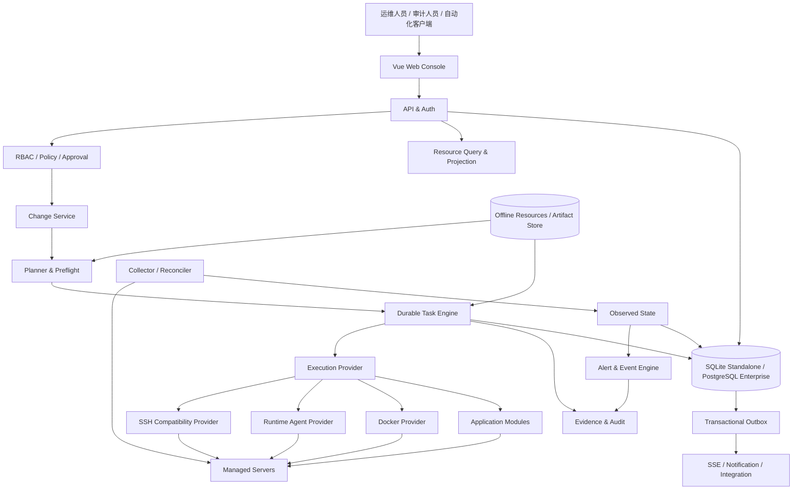
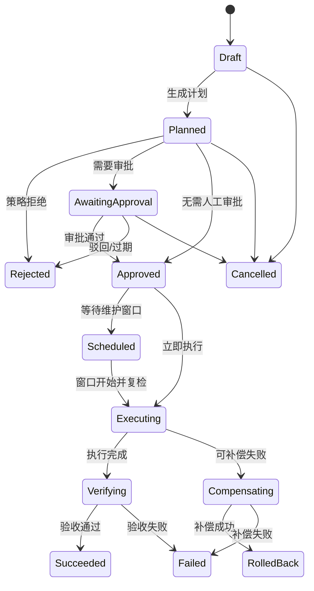

# AIFAR Deployment 企业级运维改造软件设计说明书（SDD）

> 文档状态：评审稿 v1.0
>
> 编制日期：2026-08-26
>
> 适用仓库：`D:\workspace\aifar-deployment`
>
> 适用产品：AIFAR Deployment 私有化部署运维平台
>
> 目标读者：产品负责人、架构师、研发、测试、安全、运维、交付与项目管理人员
>
> 设计路线：在当前仓库内渐进式企业化，不进行一次性重写

## 1. 文档目的

本文基于当前仓库源码、测试、发布脚本和已有专项设计，给出 AIFAR Deployment 向企业级运维平台演进的统一软件设计。本文解决以下问题：

1. 当前系统已经具备什么能力，哪些能力只是页面或控制面记录，哪些能力已经形成真实闭环。
2. 在保留 Go、Vue、离线交付和 Standalone 单二进制能力的前提下，如何提升可靠性、安全性、可审计性和可恢复性。
3. 如何把服务器、应用、容器、数据库、Nacos、MinIO、AIFAR Runtime、任务、告警和凭据统一到企业运维资源模型中。
4. 如何建立“发现问题—形成计划—风险判断—审批—执行—验证—审计—恢复”的标准变更闭环。
5. 如何从当前 SQLite 单实例控制面平滑演进到可选的 Enterprise Profile，而不破坏现有离线私有化交付。
6. 如何分阶段实施，使每个阶段都能独立交付、验证和回退。

本文是总体 SDD，不是逐文件编码计划。后续每个里程碑应拆成独立子规格和实施计划。

## 2. 设计结论

采用“同仓库、双运行 Profile、分阶段收敛”的渐进式方案：

- `Standalone Profile` 保留当前单二进制、SQLite 和离线包形态，面向小型私有化环境；重点补齐安全、任务可靠性、备份恢复、审计证据和可观测性。
- `Enterprise Profile` 复用同一领域模型、API 和前端，允许 API、Worker、Collector/Reconciler 分角色运行，使用 PostgreSQL 作为权威存储，并支持高可用入口、持久任务租约、事务 Outbox 和横向扩展。
- 当前 SSH 执行通道保留为兼容通道，但必须增加主机身份校验、命令能力约束、操作证据和幂等边界。
- `aifar-agent` 继续负责目标节点本地 Runtime 调和；短期仍通过 SSH 访问回环地址，长期增加设备身份、mTLS 和受控双向通道。
- 具体应用差异继续由 `backend/internal/apps/<app>` 模块承载；平台核心只维护生命周期协议、资源模型、任务编排、审批、审计和策略，不继续堆积服务特例。
- 不把浏览器页面状态当作真实状态；权威状态由资源期望态、采集实际态、任务结果和验收证据共同构成。
- 所有高风险变更统一走 `Plan -> Policy -> Approval -> Execute -> Verify -> Evidence`，不得由同步 HTTP 请求直接执行远程变更。

## 3. 现状扫描基线

### 3.1 代码规模

本次扫描排除 `node_modules`、构建产物和大体积离线资源后，代码与配置基线如下：

| 指标 | 当前规模 |
|---|---:|
| 仓库源文件、文档和配置文件 | 约 829 个 |
| 后端 Go 代码 | 约 133,000 行 |
| 前端 Vue/TypeScript 代码 | 约 34,900 行 |
| 后端领域包 | 30 个 |
| HTTP API 路由 | 130 个 |
| 其中变更类路由 | 81 个 |
| SQLite 表 | 36 张 |
| 自动化测试文件 | 205 个 |

当前系统已经超过“部署脚本集合”的规模，应以控制面产品而非脚本工具的标准治理。

### 3.2 当前进程与组件

| 组件 | 当前职责 | 主要代码 |
|---|---|---|
| `aifar-server` | 配置加载、SQLite、资源扫描、API、任务、采集、告警、静态页面 | `backend/cmd/aifar-server/main.go` |
| `aifar-agent` | 本机 Docker Runtime 调和、Service 代理、Nacos 注册、状态接口 | `backend/cmd/aifar-agent/main.go`、`backend/internal/runtimeagent` |
| `aifar-admin` | 数据检查和管理员重置 | `backend/cmd/aifar-admin/main.go` |
| `aifar-smoke` | 只读及受控端到端环境检查 | `backend/cmd/aifar-smoke` |
| Web Console | 服务器、应用、容器、数据库、Nacos、存储、凭据、任务、审计等工作台 | `web/src` |
| 发布工具链 | 前后端构建、离线打包、checksum 复验、跨平台脚本验证 | `scripts`、`.github/workflows` |

### 3.3 已形成的可靠基础

以下能力应复用，不应推倒重做：

- Chi `/api/v2` API、统一错误体 `{ code, message, details }` 和中英文展示层。
- bcrypt 本地账号、JWT、用户 `tokenVersion` 失效机制和登录失败锁定。
- 静态 RBAC 基础，已有 owner/admin/operator/viewer/auditor 角色和模块权限点。
- AES-GCM 凭据加密、previous key 单事务轮换、凭据版本、绑定和引用关系。
- Worker 任务、目标、步骤、日志、取消、终态原子化、操作锁和 SSE 事件。
- `schema_migrations`、`operation_locks`、任务 lease/idempotency/correlation 预留字段。
- `app_clusters`、`app_cluster_members`、`app_releases`、制品、快照和备份记录底座。
- `status_snapshots`、状态历史、Collector、Alert、Realtime Hub 和前端实时刷新。
- Docker、MySQL、MySQL Router、Redis、MinIO、Nacos、AIFAR 模块自注册。
- AIFAR Runtime 的期望态/实际态、generation、Deployment/Pod/Service、更新和回滚基础。
- MySQL 备份、校验、恢复和灾难重建的专项能力。
- 发布包弱默认值检查、文件 checksum、归档解包复验和 CI 门禁。

### 3.4 当前关键结构风险

| 等级 | 现状证据 | 企业风险 | 目标改造 |
|---|---|---|---|
| P0 | SSH 使用 `ssh.InsecureIgnoreHostKey()` | 中间人攻击或目标机误连 | 主机指纹注册、变更审批和 fail-closed 校验 |
| P0 | 任务实际由进程内 goroutine 执行，重启后把运行中任务标记失败 | 长任务不可恢复，单实例故障中断变更 | 持久任务租约、检查点、重试/恢复策略和 fencing |
| P0 | 审计日志可通过普通管理接口删除 | 无法满足高可信审计和不可抵赖要求 | 追加写、哈希链、归档导出和受控保留策略 |
| P0 | API 允许查询参数携带 token，服务端直接 `ListenAndServe` | URL 泄密和传输安全依赖不明确 | 禁止普通 HTTP 查询 token，明确 TLS 终止和可信代理 |
| P1 | Realtime Hub、登录锁定、Worker 活跃状态均在内存 | 多副本不一致，进程重启丢状态 | 数据库租约/Outbox、共享限流状态或明确单实例边界 |
| P1 | RBAC 主要按模块划分，viewer/auditor 权限语义较弱 | 无资源范围、环境隔离和职责分离 | 动作级权限、资源组、环境、条件和审批策略 |
| P1 | Collector 只覆盖有限状态族，告警规则硬编码 | 无统一指标、阈值、静默、通知和告警路由 | OTel/Prometheus 标准遥测与规则化告警 |
| P1 | Storage 部分对象仍是控制面记录 | 页面记录可能与真实 MinIO 状态漂移 | Provider 实操、实际态回读、幂等与漂移检测 |
| P1 | 备份闭环主要覆盖控制面 SQLite 和 MySQL | 不能证明整个平台业务可恢复 | Redis、MinIO、Nacos、Runtime 配置和密钥材料的统一 DR |
| P1 | 多个核心文件超过 2,000 行 | 变更冲突、测试和评审成本高 | 按领域服务、控制器、投影器和 Provider 渐进拆分 |
| P2 | Docker 仍大量依赖 CLI 文本或 SSH CLI | 协议脆弱、错误分类困难 | 稳定 Docker Provider 接口，逐步切换 Engine API |
| P2 | 缺少 OpenAPI、统一请求追踪和通知适配器 | 外部集成与故障定位成本高 | OpenAPI、correlation ID、Webhook/邮件等通知接口 |

## 4. 目标、非目标与约束

### 4.1 目标

1. 所有远程变更都可计划、可审批、可追踪、可取消、可验证、可恢复。
2. 支持服务器、集群、应用实例、Runtime 资源、配置、凭据、备份和告警的统一资源视图。
3. 支持生产、预生产、测试等环境隔离和资源组授权。
4. 支持应用安装、检查、配置、升级、回滚、扩缩容、备份、恢复和卸载的标准生命周期。
5. 支持断网、进程重启、重复请求和部分节点失败下的确定性行为。
6. 支持平台自身和受管服务的备份恢复与演练证据。
7. 支持离线交付、完整性验证、版本兼容和安全升级。
8. 在不改变现有 `/api/v2` 主兼容边界的前提下逐步引入企业能力。
9. 为同仓库 Enterprise Profile 的 PostgreSQL、多进程角色和高可用部署预留稳定边界。

### 4.2 非目标

- 不在本次改造中重写全部 Go/Vue 代码。
- 不以微服务数量作为企业化指标。
- 不把 AIFAR 建成任意命令执行平台或完整堡垒机。
- 不自行实现完整 Kubernetes、Prometheus、日志数据库或消息队列。
- 不承诺所有有状态服务都可以使用同一通用扩缩容算法。
- 不允许 AI、页面或应用包绕过任务、策略、审批和审计直接操作生产节点。
- 不把 SQLite Standalone 宣传为无单点的高可用控制面。
- 不在第一阶段引入 SaaS 多租户计费体系。

### 4.3 硬约束

- 保留 Go 后端、Vue 3 前端、Linux 离线交付和单二进制托管静态页面能力。
- 保持 `/api/v2` 和现有稳定机器码，破坏性接口只允许通过版本化替代。
- 所有新增用户可见文案提供中文和英文。
- 所有新增远程变更继续走 Worker、任务步骤、目标和审计。
- 敏感字段不得进入日志、审计、事件、诊断包或浏览器持久缓存。
- 真实 SSH/Docker 测试使用 fake remote，不连接现场服务器。
- PostgreSQL、OTel、通知等增强能力必须在离线环境有明确安装包和禁用降级策略。

## 5. 方案比较与决策

| 方案 | 描述 | 优点 | 缺点 | 决策 |
|---|---|---|---|---|
| A. 单实例持续补丁 | 永久保留单进程 SQLite，只补页面和功能 | 交付最快 | 任务恢复、HA、审计和扩展上限无法根治 | 不采用 |
| B. 同仓库渐进式双 Profile | 先加固当前架构，再抽象存储、任务、事件和 Provider，增加 Enterprise Profile | 保留现有资产，迁移风险可控，每阶段可交付 | 需要长期兼容管理和严格架构边界 | 采用 |
| C. 全新仓库重建 | 直接按 PostgreSQL、gRPC、Kubernetes、多租户重写 | 长期模型最干净 | 周期长，当前能力和事故经验难以完整迁移 | 当前不采用 |

选择方案 B。若未来需要 SaaS 或大规模多 Cell，应另立产品级 ADR；本 SDD 不提前实施该复杂度。

## 6. 设计原则

1. **先计划后执行**：远程变更先生成不可变计划和影响摘要。
2. **期望态与实际态分离**：数据库保存意图，Collector/Agent 保存观察，Reconciler 负责收敛。
3. **控制面不等于目标状态**：控制面记录必须通过目标端回读和验收转为 `verified`。
4. **所有写操作可关联**：`requestId`、`correlationId`、`changeId`、`taskId`、目标资源和审计记录贯通。
5. **幂等优先**：重复提交、超时重试和进程恢复不得重复执行危险动作。
6. **失败关闭**：身份、权限、指纹、签名、校验或状态不确定时停止变更。
7. **职责分离**：API 解析请求，领域服务生成计划，Worker 执行，Provider 操作目标，Verifier 验收。
8. **最小权限**：用户、Server、Agent、数据库和对象存储均使用最小范围权限。
9. **可逆优先**：升级前快照、配置版本、制品保留和明确回滚窗口。
10. **观测不驱动盲目修复**：告警可生成诊断和建议，生产自动修复必须有独立策略。
11. **Profile 一致**：Standalone 和 Enterprise 使用同一领域协议，不维护两套业务代码。
12. **离线可验证**：依赖、镜像、二进制、SBOM、签名和 checksum 均随离线包交付。

## 7. 目标总体架构



### 7.1 模块化单体边界

第一阶段仍由 `aifar-server` 单进程启动，但内部按以下角色解耦：

| 角色 | 职责 | Standalone | Enterprise |
|---|---|---|---|
| API | 鉴权、查询、命令接收、计划预览 | 同进程 | 多副本 |
| Worker | 领取任务、执行步骤、补偿、验收 | 同进程 | 独立副本 |
| Collector | 采集服务器与组件实际态 | 同进程 | 独立副本/分片 |
| Reconciler | 比较期望态和实际态，产生受控动作 | 同进程 | 独立副本/租约 |
| Event Dispatcher | Outbox 投递 SSE、通知和集成事件 | 同进程 | 独立副本 |
| Static UI | 托管前端 | 同进程 | API 或独立 Nginx |

进程拆分通过启动角色实现，例如 `AIFAR_PROCESS_ROLES=api,worker,collector,dispatcher`；不是复制业务实现。

### 7.2 数据面边界

- SSH Provider：负责已注册服务器上的受控命令和文件传输，作为部署、修复和兼容通道。
- Runtime Agent Provider：负责 AIFAR Runtime 资源声明、调和和本机状态，不承担全局审批或任务编排。
- Docker Provider：提供容器、镜像、网络、卷和事件的稳定类型接口，逐步替换 CLI 文本解析。
- Application Module：提供特定应用的预检、计划、执行、检查、备份、恢复等能力。
- Provider 不决定用户是否有权操作，也不直接写审计结论；这些由控制面统一负责。

## 8. 企业运维领域模型

### 8.1 组织、环境和资源组

私有化首期不引入完整 SaaS 租户体系，但增加以下轻量边界：

- `Environment`：`production`、`staging`、`test` 等风险和策略边界。
- `ResourceGroup`：按项目、业务系统或部门组织资源。
- `ManagedResource`：服务器、集群、应用实例、Runtime Deployment、数据库、存储、配置、凭据引用等统一资源索引。
- `ResourceRelation`：`contains`、`member-of`、`depends-on`、`routes-to`、`uses-credential`、`protected-by-backup` 等关系。

现有 `servers`、`app_instances`、`app_clusters` 等表仍保存领域明细；统一资源表只建立全局身份、归属、关系和搜索索引，不复制全部业务字段。

### 8.2 资源标识

统一资源名格式：

```text
aifar:<environment>:<resourceType>:<resourceId>
```

例如：

```text
aifar:production:server:srv_xxx
aifar:production:app-instance:app_xxx
aifar:production:aifar-deployment:app_xxx/gateway
```

所有任务、变更、告警、配置、备份和审计均引用稳定资源名，而不是仅使用页面名称或 IP。

### 8.3 生命周期能力协议

扩展 `backend/internal/apps/registry`，将当前分散的可选接口收敛为显式能力描述：

```text
Install / Check / Configure / Upgrade / Rollback
Scale / Backup / VerifyBackup / Restore / Delete
Collect / Diagnose / Reconcile
```

每个能力必须声明：

- 风险等级：`read`、`low`、`medium`、`high`、`critical`。
- 支持拓扑和版本范围。
- 是否需要维护窗口。
- 是否需要审批及审批人数。
- 是否可重试、是否可补偿、是否可恢复。
- 所需凭据种类和最小权限。
- 计划步骤、验收步骤和停止条件。
- 是否支持 dry-run、备份点和回滚。

前端根据能力描述渲染入口，不再根据应用名称硬编码生命周期按钮。

## 9. 标准变更闭环



### 9.1 Change 与 Task 分离

- `Change` 表示为什么改、改什么、风险、审批和维护窗口。
- `Task` 表示如何执行、在哪些目标执行、每一步结果和日志。
- 一个 Change 可包含多个 Task；重试创建新的 Task Attempt，不覆盖旧证据。
- 只读检查可以直接创建 Task，但仍需权限、审计和 correlation ID。

### 9.2 计划冻结

计划通过后冻结以下内容：

- 动作、目标资源和目标版本。
- 参数摘要及敏感字段引用，不保存明文。
- 当前实际态版本、配置 hash 和资源 generation。
- 预计影响、依赖关系和停止条件。
- 所需凭据引用及其版本。
- 制品 SHA-256、签名主体和兼容性结果。
- 备份点要求和回滚目标。

执行前重新检查资源版本、凭据版本、维护窗口和审批状态；发生漂移时退回重新计划。

### 9.3 风险与审批默认策略

| 动作 | 默认风险 | 默认策略 |
|---|---|---|
| 状态、日志、配置只读查询 | read | 无审批，完整鉴权 |
| 服务检查、资源重扫 | low | 无审批，写审计 |
| 单实例重启、低风险配置 | medium | 生产环境需要确认和窗口 |
| 安装、升级、扩缩容、凭据轮换 | high | 生产环境至少一名授权审批人 |
| 恢复、集群重建、批量卸载、清理数据 | critical | 双人审批、备份检查、维护窗口、owner 执行 |

审批人不得审批自己创建的 critical 变更。Break-glass 只允许 owner 使用，必须填写原因、设置短期有效期并触发独立告警。

## 10. 持久任务引擎

### 10.1 目标状态

复用现有 `tasks`、`task_targets`、`task_steps`、`task_logs`、`operation_locks` 和预留 lease 字段，完成以下状态机：

```text
pending -> leased -> running -> committing -> verifying
        -> retry_wait -> leased
        -> success | failed | cancelled | timeout | needs_attention
```

对现有 API 仍可投影为兼容的 `pending/running/success/failed/cancelled`。

### 10.2 领取和租约

- Worker 使用数据库原子条件更新领取任务。
- `lease_owner` 为 Worker 实例 ID，`lease_expires_at` 为租约到期时间。
- 执行期间定期续租；只有持有当前 fencing token 的 Worker 可以提交步骤终态。
- Worker 失联后，任务进入 `needs_attention` 或按动作策略重新领取。
- 不可安全重试的任务禁止自动重跑，必须先执行远端观察和人工决策。

### 10.3 幂等和恢复

- HTTP 变更请求支持 `Idempotency-Key`，作用域为用户、动作和目标资源。
- 同一幂等键返回原 Change/Task，不重复创建。
- 每个步骤声明 `retryPolicy`、`resumeStrategy`、`compensation` 和 `commitBoundary`。
- 远端脚本使用任务 ID、步骤 ID 和输入 hash 建立工作目录与完成标记。
- 控制面重启后先检查远端标记和实际态，再决定成功、恢复、重试或待处理。
- `TryEnterCommit` 的现有语义保留并升级为持久提交边界。

### 10.4 事务 Outbox

任务、告警、审计或资源状态写入数据库时，同时在同一事务写入 `outbox_events`。Dispatcher 异步投递：

- SSE 实时事件。
- Webhook/邮件等通知。
- 外部 SIEM/ITSM 集成。

消费者使用事件 ID 去重；Realtime overflow 继续触发客户端全量刷新，但不再是唯一恢复机制。

## 11. 资源状态、采集和调和

### 11.1 状态模型

每个资源统一维护：

- `desiredGeneration`：期望态代数。
- `observedGeneration`：已观察并接受的代数。
- `phase`：生命周期阶段。
- `conditions[]`：`type/status/reason/message/lastTransitionAt`。
- `lastObservedAt`、`source`、`collectorVersion`。
- `staleAfter`：超过时间后状态显示为 stale/unknown，不能继续显示为正常。

### 11.2 Collector 改造

- Collector 定义统一接口、超时、并发、freshness 和错误分类。
- 每个采集族通过数据库租约防止多副本重复采集。
- Server、Docker、Application、Runtime、Database、Storage、Nacos 分开调度。
- 采集失败不得无条件清空最近成功状态；必须同时展示“最后成功值”和“当前采集失败”。
- 状态历史只保留运维事件级变化，连续指标进入遥测后端。

### 11.3 Drift 检测

配置、Runtime spec、应用版本、容器标签、集群成员和凭据绑定都可以产生 Drift：

```text
in_sync / drifted / unknown / conflict / externally_managed
```

Drift 默认只告警和生成修复计划。只有明确声明为 `autoReconcile=true`、风险不高于 medium 且满足维护策略时，才允许自动执行。

## 12. 安全设计

### 12.1 身份和会话

- 保留本地账号和 tokenVersion；增加会话记录、设备信息、显式退出和全部会话吊销。
- Enterprise Profile 增加 OIDC，LDAP/SAML 通过统一 Identity Provider 接入，不在核心中分别实现多套登录流程。
- Access Token 缩短有效期并增加 Refresh Session；Refresh Token 只保存在 `HttpOnly + Secure + SameSite` Cookie。
- 禁止普通 API、SSE 和下载链接使用查询参数 token；WebSocket 使用受控子协议或短期一次性票据。
- 登录限流从进程内状态迁移为可共享状态，或在 Standalone 明确进程内边界。

### 12.2 授权

权限判断输入至少包含：

```text
subject + role + action + environment + resourceGroup + resource + condition
```

第一阶段使用代码内策略和数据库绑定；不强制引入 OPA。策略复杂度达到阈值后再通过 ADR 评估外部策略引擎。

建议拆分权限：

- `servers.view/manage/connect`
- `apps.view/install/configure/upgrade/rollback/delete`
- `runtime.view/reconcile/scale/offline`
- `database.view/backup/restore/rebuild`
- `storage.view/manage/replicate/delete`
- `credentials.view/use/rotate/manage`
- `changes.create/approve/execute/cancel`
- `audit.view/export/retention.manage`
- `platform.manage/breakglass`

### 12.3 SSH 主机身份

- 首次添加服务器时采集算法和主机公钥指纹，必须由用户确认后保存。
- 后续连接必须匹配保存指纹，不得使用 `InsecureIgnoreHostKey`。
- 指纹变化视为高风险安全事件，禁止自动更新。
- 指纹轮换通过独立 Change 完成，记录旧值、新值、确认人和证据。
- 禁止弱算法，并提供企业兼容清单和例外审计。

### 12.4 Agent 安全

短期保持 Agent 只监听 `127.0.0.1` 并由 SSH 进入；同时明确：

- 非回环监听继续 fail-closed。
- 请求体限制、方法限制、输入 schema 和文件路径白名单必须保留。
- Agent 状态目录、spec 和制品均校验所有权、权限和 hash。

Enterprise Agent 通道采用：

- 安装时生成一次性注册令牌。
- 注册后签发设备证书和稳定 agent ID。
- mTLS 双向认证、证书轮换、吊销和版本协商。
- 只接受签名 Assignment，不接受自由 shell。
- Agent 断线继续保持已接受期望态，不执行未确认的新动作。

### 12.5 凭据

- 凭据值继续 AES-GCM 加密，增加密钥版本和轮换作业。
- 任务只持有 credential reference，不把明文写入任务参数。
- 解密只发生在执行边界，输出统一进入 `logmask`。
- 临时文件权限必须为 `0600`，远端和本地都必须在 finally/defer 中清理。
- 删除凭据前检查 `credential_references` 和运行中 Change/Task。
- Enterprise Profile 支持外部 Secret Provider，但不强制绑定具体厂商。

### 12.6 审计不可抵赖

审计采用追加写：

- 普通角色不能删除单条审计。
- 保留清理必须通过策略、审批和归档证明。
- 每条记录包含前一条 hash，形成分段哈希链。
- 每日生成封存清单并支持导出到只写对象存储或 SIEM。
- 审计消息只保存结构化摘要、资源版本和证据引用，不保存秘密。
- 对审计数据的查看、导出、归档和保留策略修改本身也写审计。

## 13. 可观测性与告警

### 13.1 平台自身遥测

引入 OpenTelemetry 语义但允许组件按 Profile 启用：

- Metrics：Prometheus `/metrics`，覆盖 API、Worker、Collector、Reconciler、DB、SSH、Agent 和 Outbox。
- Traces：HTTP 请求、Change、Task、步骤、Provider 调用和 Agent Assignment 贯通。
- Logs：结构化 JSON，包含 `requestId/correlationId/changeId/taskId/resourceId`。
- Health：`live` 只表示进程存活，`ready` 检查数据库、迁移状态、关键目录和角色依赖。

禁止把高频指标明细写入 SQLite/PostgreSQL 主业务表。

### 13.2 关键指标

| 范围 | 指标 |
|---|---|
| API | RPS、P50/P95/P99、4xx/5xx、在途请求 |
| Worker | 队列深度、排队时间、执行时间、租约丢失、重试、补偿 |
| Collector | 采集延迟、超时、状态 freshness、每目标错误率 |
| Reconciler | generation backlog、收敛时间、冲突和漂移数 |
| SSH/Agent | 建连延迟、认证失败、指纹冲突、断线和重连 |
| 应用 | 实例可用性、集群角色、复制延迟、容量水位、备份新鲜度 |
| 数据库 | 连接、锁等待、慢查询、WAL/文件增长和备份状态 |

### 13.3 告警生命周期

告警状态统一为：

```text
open -> acknowledged -> suppressed/muted -> resolved
```

增加规则、路由、静默、维护窗口、抑制、去重和通知状态。告警必须保存：

- 指纹、规则版本、严重度和资源范围。
- 首次/最近发生时间和连续失败次数。
- 证据引用和最近成功状态。
- 所需权限和推荐 Runbook。
- 通知目标与投递结果。

通知通过 Adapter 支持 Webhook、邮件和客户自有平台；不把外部地址硬编码进业务模块。

## 14. 配置管理

### 14.1 配置对象

统一管理以下配置：

- 应用参数和环境变量。
- Nacos 配置及发布版本。
- Runtime 资源和服务配置。
- 安装器模板覆盖。
- 平台设置、Collector 和告警策略。

每次配置变更产生不可变 Revision：

```text
revisionId, schemaVersion, contentHash, secretRefs,
createdBy, reason, createdAt, sourceRevisionId
```

### 14.2 Preview 和发布

- 展示规范化 diff、受影响资源和重启要求。
- schema、范围、Secret Reference 和依赖预检通过后才能发布。
- 生产发布必须关联 Change。
- 发布后回读实际态并比较 hash。
- 回滚创建新 Revision，不把历史版本重新改成 active。

### 14.3 Nacos 边界

复用现有 Nacos preview/publish/rollback 和 revision 基础，补齐：

- namespace/group/dataId 资源归属。
- 目标 Nacos 实例和凭据版本冻结。
- 发布前旧值备份和服务影响分析。
- 发布后 checksum 回读。
- 部分节点连接失败时的明确状态和恢复步骤。

## 15. 备份、恢复与灾难恢复

### 15.1 统一模型

扩展现有 `app_backups`，增加：

- `BackupPolicy`：对象、方式、频率、保留、目标、加密和验证规则。
- `BackupRun`：每次执行的任务、制品、manifest、checksum 和结果。
- `RecoveryPoint`：可恢复对象、依赖、兼容版本和 RPO 时间点。
- `RestoreDrill`：隔离恢复、验证项、结果和证据。

备份成功必须同时满足：

1. 命令成功。
2. 制品存在、大小合理且 checksum 可复验。
3. manifest 完整。
4. 目标存储可读取。
5. 最近一次独立恢复演练仍在有效期内，才能标记为 `recovery-proven`。

### 15.2 保护对象

| 对象 | 备份内容 | 恢复验收 |
|---|---|---|
| AIFAR 控制面 | DB、配置、资源索引、任务/审计、密钥版本元数据 | 完整性检查、启动、登录、资源关联和历史可查询 |
| MySQL | 逻辑/物理备份、GTID、拓扑和账号依赖 | 隔离恢复、表/行抽样、应用连接和集群状态 |
| Redis | RDB/AOF、配置、ACL、Sentinel/Cluster 拓扑 | 启动、数据抽样、角色、复制和应用连接 |
| MinIO | Bucket 数据、版本、配置、用户策略、复制配置 | 对象 checksum、版本、权限和复制状态 |
| Nacos | MySQL 数据、application.properties、命名空间和配置清单 | 集群健康、配置读取、服务注册和应用启动 |
| AIFAR Runtime | runtime spec、配置 Revision、release manifest、镜像清单 | Agent 加载、容器收敛、Service/Nacos 路由和业务探测 |
| 凭据与密钥 | 加密数据库、外部托管密钥备份/托管证明 | 在隔离环境解密并完成受控连接验证 |

### 15.3 调度与保留

- Standalone 可使用内置持久计划器或 systemd timer，调度记录仍回写控制面。
- Enterprise 使用数据库抢占式调度租约，避免多副本重复执行。
- 保留删除前先检查法务保留、最近成功备份数、异地副本和恢复演练。
- 清理也是高风险任务，必须有 dry-run、候选清单和删除证据。

### 15.4 平台 DR

- Standalone 明确单点，提供可执行的备份、替换部署、恢复和验收工具。
- Enterprise Profile 分别定义 API、PostgreSQL、对象存储、入口和 Runtime Gateway 的故障域。
- 控制面不可用时，已运行 Runtime 服务保持现状；禁止执行新的全局变更。
- 恢复后先重建控制面和资源索引，再恢复任务调和，不直接批量重启业务。

## 16. 数据设计

### 16.1 复用现有表

继续使用并增强：

- 身份：`users`。
- 资产：`servers`、`app_instances`、`app_clusters`、`app_cluster_members`。
- 任务：`tasks`、`task_targets`、`task_steps`、`task_logs`、`operation_locks`。
- 发布：`app_releases`、`app_release_artifacts`、`app_release_snapshots`。
- 备份：`app_backups`。
- 凭据：`credentials`、`credential_versions`、`credential_bindings`、`credential_references`。
- 状态与告警：`collector_runs`、`status_snapshots`、`status_snapshot_history`、`alerts`、`alert_events`。
- Runtime：`aifar_deployments`、`aifar_replicasets`、`aifar_pods`、`aifar_service_endpoints`。

### 16.2 新增表

| 表 | 用途 | 关键字段 |
|---|---|---|
| `environments` | 环境和默认风险策略 | `id/name/type/status/policy_json` |
| `resource_groups` | 项目或业务资源分组 | `id/environment_id/name/owner/status` |
| `managed_resources` | 全局资源索引 | `urn/type/native_id/environment_id/resource_group_id/version/status` |
| `resource_relations` | 资源依赖图 | `source_urn/relation/target_urn/metadata_json` |
| `role_bindings` | 用户到环境/资源组的角色绑定 | `subject_id/role/scope_type/scope_id` |
| `changes` | 变更意图和状态 | `id/action/risk/status/requested_by/plan_hash/window_id` |
| `change_targets` | 冻结目标和版本 | `change_id/resource_urn/observed_version/desired_version` |
| `change_approvals` | 审批和职责分离 | `change_id/decision/actor/reason/decided_at` |
| `maintenance_windows` | 允许执行的时间窗口 | `environment_id/start_at/end_at/recurrence/timezone` |
| `task_checkpoints` | 持久步骤检查点 | `task_id/step_name/attempt/state/input_hash/output_ref/fencing_token` |
| `outbox_events` | 事务事件投递 | `id/type/aggregate_id/payload/created_at/published_at/attempt` |
| `config_revisions` | 通用配置版本 | `resource_urn/schema_version/content_hash/content/secret_refs` |
| `drift_findings` | 漂移与修复状态 | `resource_urn/type/severity/status/evidence/observed_at` |
| `backup_policies` | 统一备份策略 | `resource_urn/schedule/retention/target/verification_policy` |
| `backup_runs` | 统一执行与恢复点 | `policy_id/task_id/status/manifest_ref/checksum/recovery_proven` |
| `audit_segments` | 审计哈希链封存 | `segment_date/first_id/last_id/root_hash/archive_ref` |
| `sessions` | 会话和吊销 | `id/user_id/token_hash/expires_at/revoked_at/device` |
| `agent_identities` | Agent 设备身份 | `agent_id/server_id/cert_serial/status/last_seen_at` |

### 16.3 存储抽象

不创建一个包含所有方法的巨大 Store 接口。按领域定义小接口：

```text
IdentityStore
InventoryStore
ChangeStore
TaskStore
LeaseStore
OutboxStore
ResourceStateStore
AuditStore
BackupStore
```

第一阶段由 SQLite 实现；Enterprise Profile 增加 PostgreSQL 实现。领域层不得依赖 SQLite 特有 SQL。

### 16.4 数据迁移

- 所有迁移继续登记 `schema_migrations`。
- 采用 expand-contract：先加表/字段和双读，再迁移数据，最后停止旧写入。
- Standalone 到 Enterprise 提供 `aifar-admin migrate-database`：预检、导出、导入、行数/hash 校验、只读切换和回滚窗口。
- 不允许客户手工复制部分表完成升级。

## 17. API 设计

### 17.1 兼容原则

- 保持 `/api/v2`。
- 现有查询接口逐步返回统一资源引用，但不删除原字段。
- 新写接口优先使用 Change Command；旧写接口内部适配为 Change，不复制执行逻辑。
- 所有集合接口支持分页、过滤和稳定排序。
- 发布 OpenAPI 文档和机器可读错误码目录。

### 17.2 新增资源接口

```text
GET    /api/v2/inventory/resources
GET    /api/v2/inventory/resources/{urn}
GET    /api/v2/inventory/resources/{urn}/relations

POST   /api/v2/changes/plan
POST   /api/v2/changes
GET    /api/v2/changes
GET    /api/v2/changes/{id}
POST   /api/v2/changes/{id}/approve
POST   /api/v2/changes/{id}/reject
POST   /api/v2/changes/{id}/execute
POST   /api/v2/changes/{id}/cancel

GET    /api/v2/configurations/{urn}/revisions
POST   /api/v2/configurations/{urn}/preview
POST   /api/v2/configurations/{urn}/publish
POST   /api/v2/configurations/{urn}/rollback

GET    /api/v2/backup-policies
POST   /api/v2/backup-policies
POST   /api/v2/backup-policies/{id}/run
GET    /api/v2/recovery-points
POST   /api/v2/recovery-points/{id}/restore-plan

GET    /api/v2/maintenance-windows
POST   /api/v2/maintenance-windows
GET    /api/v2/audit/export-jobs
POST   /api/v2/audit/export-jobs
```

### 17.3 请求头

| Header | 用途 |
|---|---|
| `Authorization` | Bearer Access Token |
| `X-AIFAR-Language` | 展示语言 |
| `X-Request-ID` | 客户端请求 ID；服务端校验或生成 |
| `X-Correlation-ID` | 跨请求业务关联 ID |
| `Idempotency-Key` | 变更创建和执行去重 |
| `If-Match` | 资源版本/ETag 并发控制 |

响应统一回传 request/correlation ID。错误 `details` 中可返回冲突资源版本、所需权限、审批状态和停止条件，但不得包含秘密。

## 18. 前端信息架构

建议调整为企业运维工作流，而不是按底层组件平铺：

1. **运维总览**：可用性、未处理告警、待审批变更、失败任务、备份新鲜度和容量风险。
2. **资源中心**：服务器、集群、应用、Runtime、数据库、存储及依赖拓扑。
3. **应用与发布**：安装、实例、配置、发布历史、扩缩容和回滚。
4. **变更中心**：计划、审批、维护窗口、执行和验收证据。
5. **任务中心**：任务、目标、步骤、重试、补偿和日志。
6. **监控与告警**：状态、指标入口、告警、静默、通知和 Runbook。
7. **备份与恢复**：策略、运行、恢复点、演练和保留。
8. **凭据与配置**：凭据引用、轮换、配置 Revision 和 Drift。
9. **审计与合规**：审计检索、导出、封存和策略变更。
10. **平台管理**：用户、角色绑定、环境、资源组、集成和平台健康。

现有 Containers、Database、Nacos、Storage 页面可作为资源详情工作台保留，但高风险操作统一跳转到 Change 流程。

前端工程同步执行：

- 将超过 2,000 行的页面拆成 feature 模块、composable、selector、dialog 和 table schema。
- 统一资源表格：固定工作区高度、空状态、分页、列宽拖动、列设置和持久化。
- 统一操作按钮状态：权限不足、需审批、维护窗口外、状态不新鲜、依赖不可用均给出明确原因。
- 统一详情抽屉：身份、关系、期望态、实际态、条件、变更、任务、告警、备份和审计。
- 保持中文/英文文案和键盘可操作性。

## 19. 应用模块与 Provider 改造

### 19.1 Registry

把现有接口分为：

- `DescriptorProvider`：应用、版本、拓扑和能力。
- `Planner`：预检和不可变计划。
- `Executor`：按步骤执行。
- `Observer`：实际态和条件。
- `BackupProvider`：备份、验证和恢复。
- `Reconciler`：声明式收敛能力。

每个模块可只实现需要的接口。HTTP handler 不做应用名称分支。

### 19.2 SSH Provider

在 `backend/internal/adapter` 上建立稳定接口：

```text
ConnectIdentity
RunCommand(CommandSpec)
Upload(ArtifactSpec)
Download(EvidenceSpec)
StreamLogs(StreamSpec)
```

`CommandSpec` 只能来自平台注册动作或模板，不接受 API 自由 shell。结果包含退出码、分类错误、stdout/stderr 摘要、证据引用和时序。

### 19.3 Docker Provider

分阶段：

1. 先把 CLI 输出集中到 Provider DTO 和错误分类。
2. 为 Container/Image/Network/Volume/Event 定义稳定接口和契约测试。
3. 优先在 Agent 内使用 Docker Engine API。
4. SSH CLI 保留为兼容回退，但 UI 明确数据来源和能力差异。

### 19.4 MinIO Provider

Bucket、Object、User、AccessKey、Replication 和 ILM 的真实操作必须：

- 通过 `mc` 或 S3/Admin API 执行。
- 先读取当前态并产生 diff。
- 使用任务和审计。
- 操作后回读验证。
- 控制面记录仅作缓存和历史，不作为唯一成功依据。

## 20. 平台部署与高可用

### 20.1 Standalone Profile

- 单个 `aifar-server`。
- SQLite WAL 和定期在线备份。
- 本地或挂载目录保存诊断包和离线资源。
- Nginx/客户负载均衡负责 TLS。
- 明确单点和恢复手册，不标记为 HA。

### 20.2 Enterprise Profile

- 至少两个 API 副本。
- 一个或多个 Worker/Collector/Dispatcher 副本。
- PostgreSQL HA 方案由单独 ADR 和认证矩阵确定。
- 对象存储保存长日志、诊断包、备份 manifest 和大型制品。
- 入口使用客户 LB/Keepalived 或认证 K3s Ingress。
- 所有抢占任务、Collector 和 Reconciler 使用数据库租约及 fencing。

### 20.3 可用性边界

- API 故障不应停止已运行的目标服务。
- 单个 Worker 故障不应产生双执行；可恢复任务在租约过期后继续。
- Collector 故障应显示状态过期，不得把资源误判为健康。
- 数据库不可用时拒绝新变更，不允许脱离审计直接执行。
- Realtime/SSE 中断后客户端通过版本化快照恢复。

## 21. 非功能要求

以下为首轮设计基线，正式承诺前必须压测和故障演练：

| 维度 | 基线 |
|---|---|
| 管理规模 | 100 台服务器、1,000 个应用/组件实例 |
| API 性能 | 不含远程操作的查询 P95 小于 500 ms |
| 变更受理 | 创建计划或任务 P95 小于 2 s |
| 状态新鲜度 | 正常网络下关键状态不超过 60 s；超时标记 stale |
| 审计完整性 | 已接受变更的审计和任务意图零丢失 |
| 幂等 | 相同幂等键不得产生重复远程变更 |
| 安全 | SSH 指纹、制品 hash/签名、权限或审批失败时禁止执行 |
| Standalone 恢复 | 通过备份在隔离环境完成恢复演练，RPO/RTO 由交付配置声明 |
| Enterprise 可用性 | API/Worker 单副本故障不影响已运行服务，控制面目标不低于 99.9% |
| 兼容 | Server 至少兼容当前和前一 Agent 协议版本 |
| 国际化 | 新增用户可见文本全部覆盖 zh/en |

## 22. 测试策略

### 22.1 单元和契约测试

- Change 状态机、风险策略、审批职责分离和维护窗口。
- Task lease、fencing、重试、检查点、幂等和补偿。
- Store SQLite/PostgreSQL 一致性契约。
- Provider DTO、错误分类、日志脱敏和指纹校验。
- 应用能力描述、计划和实际执行接口契约。
- 配置 diff、hash、Secret Reference 和 Drift。
- 审计哈希链和归档验证。

### 22.2 集成测试

- API -> Change -> Task -> fake Provider -> Verify -> Audit 全链路。
- 重复提交、并发审批、资源版本冲突和维护窗口切换。
- Worker 在步骤前、执行中、提交边界和验收阶段崩溃。
- Outbox 写入成功但投递失败、重复投递和乱序。
- SQLite 迁移、PostgreSQL 迁移和跨数据库迁移工具。

### 22.3 安全测试

- SSH 主机指纹首次确认、变化、弱算法和并发轮换。
- 越权、跨资源组访问、自己审批 critical 变更和过期审批。
- Token URL 泄露、会话吊销、Refresh 重放和 WebSocket 票据。
- 制品篡改、路径穿越、符号链接、压缩炸弹和 SBOM/签名失败。
- 日志、审计、事件、诊断包和错误体中的秘密扫描。

### 22.4 故障和恢复测试

- API、Worker、Collector、数据库、对象存储和 Agent 单点故障。
- SSH 断开、目标机重启、部分集群成员失败和网络分区。
- MySQL/Redis/MinIO/Nacos/AIFAR Runtime 分层恢复。
- 完整控制面替换恢复和恢复后的任务/资源对账。
- 备份文件损坏、缺失依赖、版本不兼容和恢复中断。

### 22.5 性能测试

- 100 Server 并发采集和状态推送。
- 1,000 实例资源查询、告警评估和资源关系查询。
- 大量 Agent 同时重连。
- 长任务、短任务、日志流和 SSE 混合负载。
- Outbox 积压和通知端点不可用下的背压。

## 23. 实施路线

### Phase 0：安全与可靠性止血

范围：

- SSH 主机指纹注册和强校验。
- 禁止查询参数 token，明确 TLS 和可信代理配置。
- request/correlation ID 全链路。
- 任务租约、fencing 和幂等键真正接入 Worker。
- 审计禁止普通删除、哈希链和归档基础。
- 控制面备份自动计划、校验和恢复演练命令。
- 大文件按现有边界渐进拆分，不改变用户行为。

退出条件：进程重启、重复请求和 SSH 指纹异常不会造成静默重复变更或误连。

### Phase 1：标准变更与资源中心

范围：

- Environment、ResourceGroup、ManagedResource 和关系图。
- Change、Approval、MaintenanceWindow 和风险策略。
- 生命周期能力协议和统一计划。
- 前端变更中心、资源详情和审批入口。
- 配置 Revision 与 Drift 基础。

退出条件：所有 high/critical 操作均经过标准变更闭环，旧接口内部已适配到同一执行路径。

### Phase 2：可观测性和全栈 DR

范围：

- Prometheus metrics、OpenTelemetry trace 和结构化日志。
- 告警规则、静默、抑制、通知 Adapter 和维护窗口联动。
- Redis、MinIO、Nacos、Runtime 和控制面统一备份模型。
- 恢复点、恢复计划、隔离演练和证据页面。

退出条件：平台和全部受管基础服务都有明确保护对象、恢复步骤和最近演练证据。

### Phase 3：Enterprise Profile

范围：

- Store 领域接口和 PostgreSQL 实现。
- 事务 Outbox、持久调度和多 Worker。
- API/Worker/Collector/Dispatcher 进程角色。
- Agent 设备身份、mTLS 和 Assignment 协议。
- PostgreSQL、对象存储、入口和平台升级的 HA 认证方案。

退出条件：单个无状态副本故障不阻断控制面；Worker 接管不双执行；Standalone 数据可迁移并可回退。

### Phase 4：生态和策略深化

范围：

- OIDC、外部 Secret Provider、SIEM/ITSM 集成。
- 应用包签名、SBOM、信任根和兼容认证。
- Docker Engine API 完整迁移。
- 可选策略引擎和更细粒度授权。

退出条件：新增常规应用能力主要通过模块/包接入，不修改 HTTP 核心和通用页面流程。

## 24. 代码组织建议

目标目录按职责渐进形成：

```text
backend/internal/
  identity/          # 会话、角色绑定、OIDC 接口
  inventory/         # 统一资源与关系
  changes/           # 计划、策略、审批、窗口
  workflow/          # 持久任务、检查点、补偿
  provider/
    ssh/
    docker/
    runtimeagent/
  configuration/     # revision、diff、drift
  observability/     # metrics、trace、structured log
  notification/      # webhook、email、SIEM adapters
  recovery/          # policy、run、recovery point、drill
  audit/             # append-only、hash chain、export
  apps/              # 具体应用模块
  store/
    sqlite/
    postgres/

web/src/
  features/
    inventory/
    changes/
    tasks/
    observability/
    recovery/
    configuration/
    audit/
  shared/
    resource-table/
    permission/
    status/
    evidence/
```

该目录是演进目标，不要求一次性移动现有文件。只有在行为测试覆盖、接口稳定且当前任务需要时才拆分。

## 25. 迁移与兼容策略

- 每个新能力通过 feature flag 或 Profile 配置启用。
- 旧 API 保持可用，内部创建隐式 Change；前端逐步改用显式 Change API。
- 现有任务、审计和状态数据原样可读；新字段提供默认值。
- 先建立统一资源索引并回填，再让新查询依赖它。
- 先让应用模块声明能力，再删除前端硬编码。
- Agent 协议使用 feature negotiation；Server 只调用 Agent 已声明能力。
- SSH Provider 和 Agent Provider 并存，直到 Agent 通道在目标操作上完成等价验收。
- SQLite 始终保留 Standalone 支持；Enterprise Profile 不使用双主 SQLite 或共享文件系统伪装 HA。

## 26. 风险与缓解

| 风险 | 影响 | 缓解 |
|---|---|---|
| 改造范围过大 | 长期无可交付版本 | 按 Phase 独立退出条件，P0 先止血 |
| 双 Profile 产生两套逻辑 | 维护成本翻倍 | 领域层共享，仅 Store/进程部署不同 |
| 任务自动重试误执行 | 数据破坏 | 动作级 retry/resume 策略，不确定即 needs_attention |
| 资源索引与领域表漂移 | 页面错误 | 事务写入、重建工具和一致性检查 |
| 审批流阻碍小环境使用 | 操作复杂 | Standalone 非生产环境允许简化策略，critical 不放宽 |
| PostgreSQL 提高离线复杂度 | 交付成本增加 | 只在 Enterprise Profile 引入并提供认证离线包 |
| OTel/监控资源消耗 | 低配环境不可用 | 可选 Profile、采样、保留和容量基线 |
| Agent mTLS 证书运维复杂 | 节点失联 | 自动轮换、重叠有效期、吊销列表和 SSH 恢复通道 |
| 应用能力抽象过度 | 模块难以实现 | 先用现有 7 个模块反推最小协议，不设计万能 DSL |
| 备份“成功”但不可恢复 | 灾难时失败 | recovery-proven 状态只由隔离恢复演练产生 |

## 27. 需要单独形成的 ADR

实施前至少形成以下 ADR：

1. PostgreSQL 驱动、迁移工具和 HA 认证方案。
2. OTel Collector、指标和日志后端的离线默认组合。
3. Agent mTLS 注册、证书签发、轮换和吊销协议。
4. 审计哈希链、外部封存和保留策略。
5. Change 风险等级、审批人数和 break-glass 规则。
6. 对象存储中的制品、日志、诊断和备份目录契约。
7. Docker Engine API 的版本兼容矩阵。
8. OIDC Provider、会话和 Refresh Token 模型。
9. Standalone 到 Enterprise 数据迁移和回退流程。
10. 应用包签名、SBOM 和信任根格式。

## 28. 验收标准

SDD 改造完成的产品级验收条件：

1. 任何生产变更都能从审计记录追溯到用户、计划、审批、任务、目标、步骤、证据和最终状态。
2. 重复请求或 Worker 崩溃不会导致同一危险步骤被静默重复执行。
3. SSH 主机指纹变化、制品 hash/签名失败、权限不足或审批过期时，系统明确提示并停止。
4. 状态过期时页面显示 stale/unknown，不继续使用旧数据展示“正常”。
5. 受管资源能展示期望态、实际态、generation、Conditions、关系和最近变更。
6. 所有应用模块通过统一能力协议接入生命周期，HTTP 和页面不增加应用名分支。
7. 控制面、MySQL、Redis、MinIO、Nacos 和 AIFAR Runtime 都有可执行备份、恢复和验收流程。
8. 审计不能由普通管理动作静默删除，归档可验证完整性。
9. Standalone 能离线安装、备份、恢复和升级；Enterprise 能验证 API/Worker 单副本故障接管。
10. 100 台服务器和 1,000 个实例容量基线通过压测，实际限制和推荐参数写入交付文档。
11. 新增 API 有 OpenAPI、错误码、权限和审计契约；新增 UI 文案有中英文。
12. CI 覆盖单元、集成、迁移、安全、race、构建、打包和 release checksum 验证。

## 29. 与现有专项设计的关系

以下文档作为本 SDD 的子域输入继续有效：

- `design/aifar-artifact-upgrade-rollback-enterprise-design.md`：AIFAR 制品升级和回滚。
- `design/custom-deployment-orchestration-design.md`：自定义应用编排和 Agent 边界。
- `design/single-node-k8s-runtime-resource-design.md`：Runtime 声明式资源语义参考。
- `design/enterprise-architecture-optimization-tasks.md`：已完成和待完成架构底座记录。
- `docs/superpowers/specs/2026-07-28-aifar-runtime-transactional-mutation-design.md`：Runtime 事务化变更。
- `docs/superpowers/specs/2026-08-07-aifar-runtime-per-service-controller-design.md`：每服务控制器和并发边界。

若子设计与本文冲突，以本文的企业运维总原则为准；具体实现细节仍由对应子设计和 ADR 决定。

## 30. 最终建议

第一实施批次只做 Phase 0，不同时启动 UI 大改、PostgreSQL、mTLS Agent 和全服务备份。Phase 0 的顺序建议为：

1. SSH 主机身份校验。
2. request/correlation/idempotency 贯通。
3. Worker 租约、fencing 和重启恢复。
4. 审计追加写与封存基础。
5. 控制面自动备份和恢复演练。
6. 安全和故障注入门禁。

完成上述基础后，再建设 Change/Approval 和统一资源中心。这样可以先消除会导致误操作、双执行、误连和审计缺失的核心风险，同时保持当前产品可持续交付。
