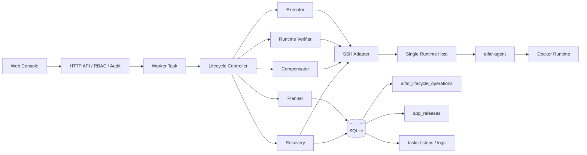
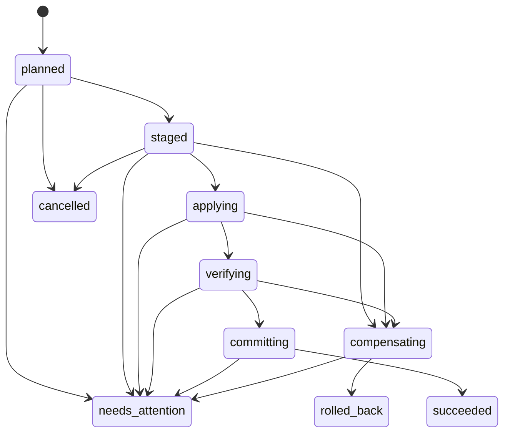

# AIFAR Runtime 单服务器生命周期可靠闭环软件设计说明书（SDD）

> 文档状态：评审稿 v1.0
>
> 编制日期：2026-08-31
>
> 适用仓库：`D:\workspace\aifar-deployment`
>
> 适用对象：单台受管服务器上的 AIFAR Runtime 应用实例
>
> 目标读者：产品负责人、架构师、研发、测试、安全、运维与交付人员
>
> 设计审批：设计内容已由用户逐段确认；本文等待书面复核
>
> 实施规则：一次只修复一个功能，自动化验证后独立提交并推送，等待用户人工验证通过并明确回复“继续”

## 1. 文档控制

### 1.1 修订记录

| 版本 | 日期 | 状态 | 说明 |
|---|---|---|---|
| v1.0 | 2026-08-31 | 评审稿 | 基于当前源码审计和已确认设计形成单服务器 AIFAR Runtime 完整生命周期 SDD |

### 1.2 文档目的

本文定义 AIFAR Runtime 在单服务器环境中的安装、升级、扩缩容、回滚、恢复、卸载和彻底清除可靠闭环。它回答以下问题：

1. 当前实现在哪些位置把“请求已接收”误当成“运行态已成功”。
2. 如何让每次生命周期变更具有不可变计划、持久检查点、明确成功门禁和自动补偿。
3. Panel 进程重启、网络中断、目标端超时或局部失败后，如何通过观察实际状态安全继续，而不是盲目重放危险步骤。
4. 如何让卸载默认可恢复，并把永久清除隔离为独立高风险动作。
5. 如何按九个阶段逐项修复、记录代码与验证证据，并在每项人工验收后再继续。

本文是本次改造的权威设计基线。它不是已经完成的实现声明；“修复与验证台账”只有在代码、测试、提交、推送和用户验证均有证据后才更新状态。

### 1.3 与既有设计的关系

本文是 `2026-08-26-aifar-enterprise-operations-transformation-design.md` 在单服务器 AIFAR Runtime 生命周期上的受限落地规格，并复用 `2026-08-07-aifar-runtime-per-service-controller-design.md` 的每服务 Manifest、generation、Condition 和锁模型。

若既有文档与本文冲突，以本文为本次九阶段实施基线，尤其包括：

- Agent `Accepted` 仍保持“Manifest 已可靠持久化并入队”的协议语义，但不再作为用户发起生命周期任务的最终成功条件。
- 新的安装、升级、扩缩容、重启和回滚任务必须等待本文第 11 章的实际态稳定门禁；后台持续调和仍可在操作完成后处理后续独立故障。
- `app_instances.status=installed` 表示该次安装已通过首次完整验收；安装完成后的新运行故障只更新 Runtime 健康，不反向篡改已完成安装历史。

## 2. 设计结论

采用“现有 Worker + SQLite + `app_releases` + `aifar-agent` 上增量建设事务化生命周期控制器”的方案，不重写 Agent，不引入多服务器编排，不改变 AIFAR Runtime 的单机 Docker 数据面。

核心结论如下：

- Agent `Accepted` 只表示精确 Manifest 已持久化并入队，不是生命周期成功。
- 生命周期成功必须证明目标端制品完整、精确 generation/spec hash 已接受、实际状态已观察、目标 revision 全部 Ready/Available，并通过连续稳定窗口和只读烟测。
- 每次操作先生成不可变计划并保存前态，再暂存、切换、验收和提交；失败自动恢复最近一次已验证状态。
- Panel 重启后按持久阶段和目标实际态决定“继续、补偿或人工介入”，禁止无条件重跑破坏性步骤。
- 默认卸载改为可恢复退役；永久删除使用独立 purge 操作，并要求多重确认和恢复快照。
- 同一实例或服务的并发操作继续使用现有编排锁，并增加操作版本 fencing，陈旧执行者不得提交。
- 实施严格分九阶段，一次只交付一个功能；每阶段更新本文台账并暂停等待用户验证。

## 3. 范围

### 3.1 包含范围

本 SDD 仅覆盖以下 AIFAR Runtime 生命周期：

1. 首次安装与重新安装。
2. 单服务制品升级。
3. 多服务整包升级。
4. 扩容、缩容、下线和滚动重启。
5. 历史版本回滚。
6. 期望态与实际态对账恢复。
7. 可恢复卸载（retire）。
8. 永久彻底清除（purge）。
9. 生命周期任务在 Panel 重启后的恢复、补偿和人工介入。

单服务器是指一个 AIFAR Deployment Panel/SQLite 控制面管理一个目标服务器上的一个 AIFAR Runtime 实例。单台目标服务器上可以运行多个 AIFAR 服务和同服务多个副本，但不设计跨主机调度、跨主机副本或多节点容灾。

### 3.2 明确不包含

- Docker、MySQL、Redis、MinIO、Nacos 自身的安装、升级、扩缩容、回滚和卸载。
- 外部 MySQL、Redis、MinIO、Nacos 业务数据的删除或恢复。
- 多服务器 Runtime 集群、跨节点调度、控制面高可用和 SQLite 主备。
- 通用任务平台的全面重构、分布式队列或 PostgreSQL 迁移。
- SSH 主机指纹体系的全平台改造。
- 普通 HTTP 查询参数 token 的全平台移除。
- AIFAR 业务服务自身的数据迁移协议。
- 任意自由 Shell、任意路径或任意 Docker 命令执行能力。

### 3.3 关联但不在本次修复的风险

源码审计还发现共享 SSH 适配器使用 `ssh.InsecureIgnoreHostKey()`，以及鉴权层允许特定查询参数 token。这两项属于平台级安全边界，不纳入九阶段生命周期代码修改，但必须保留为发布前残余风险：

- 在主机身份校验完成前，目标端 SHA-256 可以防止传输损坏和错误包执行，但不能独立抵御主动中间人替换。
- 查询参数 token 不应出现在新生命周期 API、日志、审计、计划、证据或前端 URL 中。

## 4. 当前系统基线

### 4.1 可复用能力

| 能力 | 当前实现 | 本设计用法 |
|---|---|---|
| 异步任务、步骤、目标和日志 | `backend/internal/worker` | 承载用户可见执行记录，不再作为唯一恢复状态 |
| 任务 lease/idempotency/correlation 字段 | Store 集中迁移与任务模型 | 复用关联关系；生命周期检查点使用专表 |
| AIFAR 编排锁 | `backend/internal/store/aifar_orchestration.go` | 服务锁与实例维护锁继续作为并发权威 |
| AIFAR 发布历史 | `app_releases` | 保存已提交发布版本和回滚资格 |
| Agent 每服务 Manifest | `backend/internal/runtimeagent` | 保持 `Accepted` 协议并读取实际 Condition |
| generation/spec hash | AIFAR Deployment 与 Agent 状态 | 精确识别目标状态和陈旧响应 |
| Runtime Ready/Available 状态 | Agent Controller/Ingress | 作为生命周期验收的必要证据 |
| 资源和发布 SHA-256 | 资源扫描、更新与回滚代码 | 扩展到首次安装目标端复验 |
| 审计与中英文错误 | `auditkit`、`backend/internal/i18n` | 所有新操作、错误和补偿均接入 |

### 4.2 当前关键代码路径

| 场景 | 主要代码 | 当前边界 |
|---|---|---|
| 首次安装 | `backend/internal/apps/aifar/service.go`、`templates/install.sh` | 上传后未统一做目标端 SHA-256 复验；激活目录在最终健康验收前被替换 |
| 单服务升级 | `backend/internal/apps/aifar/update.go` | 已有上传校验和发布记录，但提交成功边界早于完整 Ready/Available 验收 |
| 整包升级 | `backend/internal/apps/aifar/bundle.go` | 多服务变更可能形成部分成功，需要统一事务与全量补偿 |
| 回滚 | `backend/internal/apps/aifar/rollback.go` | 已有历史制品和 Manifest 基础，仍需前态保存、完整验收与失败反向恢复 |
| Runtime 变更 | `backend/internal/apps/aifar/runtime.go`、`deployment_control.go` | Manifest `Accepted` 被多条控制面路径当作提交条件 |
| Agent 实际态 | `backend/internal/runtimeagent/controller.go`、`ingress.go` | 已区分 Accepted、ObservedGeneration、ReadyReplicas 和 Available，可用于验收 |
| 中断恢复 | `backend/internal/worker/manager.go` | Panel 启动时把运行中任务直接标记失败，没有生命周期继续或补偿 |
| 卸载 | `backend/internal/apps/aifar/service.go`、`templates/uninstall.sh` | 删除 Agent 状态和安装根目录后删除实例记录，缺少默认可恢复边界 |

### 4.3 已验证基线

设计审计时的只读验证结果：

- `pnpm test:web`：67 个测试文件、498 项测试通过。
- 受影响后端包：`./internal/apps/aifar`、`./internal/runtimeagent`、`./internal/store`、`./internal/httpapi`、`./internal/worker` 测试通过。
- 这些测试证明当前基线可运行，但没有证明本文列出的生命周期一致性风险已修复。

## 5. 漏洞与设计追踪

| 编号 | 等级 | 当前缺陷 | 影响 | 设计控制 | 实施阶段 |
|---|---|---|---|---|---|
| AIFAR-LC-001 | P0 | 首次安装上传后缺少目标端统一 SHA-256 复验 | 错包、损坏包可能进入解压或执行 | 不可变暂存、目标端校验、失败关闭 | 1 |
| AIFAR-LC-002 | P0 | 初装在健康验收前替换/删除活动目录 | 失败时旧运行态和恢复材料可能丢失 | 版本化目录、原子切换、前态快照 | 3 |
| AIFAR-LC-003 | P0 | Agent `Accepted` 被当作生命周期成功 | 页面成功但容器未 Ready 或业务不可用 | 统一 RuntimeVerifier 与稳定窗口 | 2、3 |
| AIFAR-LC-004 | P0 | Panel 重启后运行中任务直接失败 | 长任务无安全继续与自动恢复 | 持久操作日志、检查点、fencing、启动恢复 | 2 |
| AIFAR-LC-005 | P0 | 单服务升级在完整健康前提交 | 新 revision 失败后仍可能成为活动发布 | 隔离构建、切换后验收、失败补偿 | 4 |
| AIFAR-LC-006 | P0 | 整包升级缺少跨服务全量补偿 | 部分服务新版本、部分服务旧版本 | 全部准备后分序切换，任一失败回滚全部已变更服务 | 5 |
| AIFAR-LC-007 | P1 | 扩缩容、下线、重启只证明意图接受 | 副本、Endpoint 或容器状态未收敛 | 动作专用目标态门禁和前态恢复 | 6 |
| AIFAR-LC-008 | P0 | 回滚缺少“回滚失败再回到回滚前版本”的闭环 | 二次失败后状态不确定 | 双前态证据、制品校验、反向补偿 | 7 |
| AIFAR-LC-009 | P1 | 恢复可能在未证明差异时直接变更 | 陈旧控制面状态可能覆盖正确运行态 | preview/readback/planHash/apply 两阶段恢复 | 7 |
| AIFAR-LC-010 | P0 | 卸载直接删除安装根目录和控制面记录 | 无法恢复、审计链和发布证据丢失 | 默认退役、保护归档、实例状态 `retired` | 8 |
| AIFAR-LC-011 | P1 | 取消语义没有覆盖不可逆阶段 | 切换或补偿中取消导致半完成 | 分阶段取消策略与不可取消区间 | 2 |
| AIFAR-LC-012 | P1 | 成功、失败和补偿证据分散 | 无法审计为什么成功或为何恢复 | 结构化证据、稳定错误码、台账 | 2—9 |

## 6. 设计原则

1. **先计划后变更**：任何远程写入前都必须形成不可变、可审计计划。
2. **目标端复验**：控制面本地校验不能替代目标服务器上的 SHA-256 校验。
3. **Accepted 不是 Available**：协议接收、实际观察和业务健康分别记录。
4. **保存前态再切换**：没有可验证前态和补偿材料时禁止激活新状态。
5. **不可变制品**：发布目录、配置快照和镜像 revision 不原地覆盖。
6. **单写者与 fencing**：锁租约失效或操作版本陈旧的执行者不得继续提交。
7. **观察后恢复**：进程重启先读控制面与目标实际态，再决定继续或补偿。
8. **状态不确定时停止**：无法证明安全路径时进入 `needs_attention`，阻断后续变更。
9. **退役优先于删除**：日常卸载必须可恢复，永久删除必须单独授权。
10. **证据先于成功**：验收证据持久化成功后，任务和发布记录才可进入成功终态。

## 7. 目标架构



### 7.1 组件职责

| 组件 | 职责 | 主要依赖 | 不负责 |
|---|---|---|---|
| LifecyclePlanner | 读取实例、发布、Deployment 和目标状态，生成规范化不可变计划 | Store、资源目录、模块参数 | 远程写入 |
| LifecycleExecutor | 按持久阶段执行预检、暂存、应用和提交 | Store、Remote、锁 | 自行判定业务健康 |
| RuntimeVerifier | 读取 Agent、Deployment、Pod、容器、Endpoint 和烟测结果 | Agent ingress、受控命令 | 修改目标状态 |
| LifecycleCommitter | 在证据满足后原子更新操作、发布和实例投影 | Store 事务 | 远程操作 |
| LifecycleCompensator | 恢复计划中保存的最近已验证状态并验证恢复结果 | Store、Remote、Verifier | 猜测缺失前态 |
| LifecycleRecovery | Panel 启动时领取可恢复操作，观察实际态并继续/补偿/阻断 | Store lease、Remote | 盲目重放脚本 |

### 7.2 代码组织

为避免现有 `aifar` 包与子包循环依赖，首期在 `backend/internal/apps/aifar` 同包拆分职责：

- `lifecycle_operation.go`
- `lifecycle_planner.go`
- `lifecycle_executor.go`
- `lifecycle_verifier.go`
- `lifecycle_committer.go`
- `lifecycle_compensator.go`
- `lifecycle_recovery.go`
- `lifecycle_errors.go`

Store 代码位于 `backend/internal/store/aifar_lifecycle_operations.go`，迁移继续集中在 `Store.migrate()`。HTTP handler 只解析请求、鉴权、创建任务、写审计并返回响应；不得包含安装、升级或恢复脚本逻辑。

## 8. 持久数据设计

### 8.1 `aifar_lifecycle_operations`

新增专用表，不把事务检查点继续堆入 `app_instances.metadata`。

| 字段 | 类型/约束 | 说明 |
|---|---|---|
| `id` | text primary key | 生命周期操作 ID |
| `task_id` | text not null unique | 用户可见 Worker task |
| `instance_id` | text not null | AIFAR 实例 |
| `server_id` | text not null | 单目标服务器 |
| `action` | text not null | install、reinstall、update-service、update-bundle、scale、offline、restart、rollback、reconcile、retire、purge |
| `services_json` | text not null | 排序后的目标服务名，不含秘密 |
| `plan_json` | text not null | 规范化不可变执行计划 |
| `plan_hash` | text not null | `SHA-256(canonical plan_json)` |
| `pre_state_json` | text not null | 前态 revision/generation/replicas、快照引用和 SHA-256 |
| `target_state_json` | text not null | 目标 revision/generation/replicas/spec hash |
| `phase` | text not null | 当前持久阶段 |
| `phase_sequence` | integer not null | 单调递增阶段序号 |
| `fencing_version` | integer not null | CAS/fencing 版本 |
| `attempt` | integer not null | 恢复领取次数 |
| `evidence_json` | text not null | 验收证据摘要 |
| `compensation_json` | text not null | 补偿计划、进度和结果 |
| `error_code` | text not null | 稳定机器码；无错误为空字符串 |
| `error_message_key` | text not null | i18n key；不保存敏感原文 |
| `cancel_requested` | integer not null | 取消请求标志 |
| `created_at` | datetime not null | 创建时间 |
| `updated_at` | datetime not null | 最近持久变化时间 |
| `completed_at` | datetime nullable | 终态时间 |

建议索引：

- `unique(task_id)`。
- `(instance_id, phase, updated_at)`。
- `(server_id, phase)`。
- 活动操作由领域查询和现有编排锁共同约束；SQLite 不使用数据库方言不兼容的条件唯一索引作为唯一安全边界。

### 8.2 数据职责边界

- `aifar_lifecycle_operations`：生命周期事务、检查点、恢复和补偿权威记录。
- `tasks/task_steps/task_targets/task_logs`：用户可见执行轨迹和 SSE 展示。
- `app_releases`：已提交或失败的发布历史，不承载执行检查点。
- `aifar_deployments`：每服务期望态和观察态，不承载跨步骤事务。
- `app_instances`：实例安装/退役状态与当前投影，不保存重复的生命周期计划。
- `aifar_orchestration_locks`：实例维护锁或服务锁的并发权威。

### 8.3 敏感数据规则

计划、证据、任务日志和审计不得保存：

- SSH 密码、私钥、token、完整连接串。
- 业务 env 全文、密钥文件内容或完整 Manifest 中的秘密值。
- 可直接执行的自由 Shell。

远程快照只记录受控相对路径、文件清单、大小和 SHA-256。凭据继续从加密 Store 按执行时权限读取，不复制进 lifecycle 表。

## 9. 生命周期状态机



### 9.1 阶段定义

| 阶段 | 含义 | 允许远程变更 | 可取消 |
|---|---|---:|---:|
| `planned` | 计划已固化，尚未远程写入 | 否 | 是 |
| `staged` | 制品、配置和前态已安全暂存并校验 | 仅清理本操作暂存物 | 是 |
| `applying` | 正在切换 Manifest、revision、replicas 或退役状态 | 是 | 请求转为补偿，不立即终止 |
| `verifying` | 目标已应用，正在做实际态和烟测验收 | 只读；失败可进入补偿 | 请求转为补偿 |
| `committing` | 正在持久化证据、发布和实例最终投影 | 否 | 否 |
| `succeeded` | 目标态已验证并提交 | 否 | 终态 |
| `compensating` | 正在恢复最近已验证状态 | 是 | 否 |
| `rolled_back` | 原操作失败，但前态恢复已验证 | 否 | 终态；对应 task 为 failed |
| `cancelled` | 未进入危险变更即安全取消 | 否 | 终态 |
| `needs_attention` | 无法证明继续或补偿安全 | 否 | 终态/阻断态 |

### 9.2 转换约束

- 每次转换使用 `id + fencing_version + expected phase` 做 CAS。
- `phase_sequence` 和 `fencing_version` 只增不减。
- `committing` 前必须已经持久化完整验收证据。
- `succeeded` 只能由 Committer 在同一 Store 事务中写入。
- `rolled_back` 必须包含补偿后的完整健康证据；仅执行了恢复命令不算成功补偿。
- `needs_attention` 会保留编排阻断标记；没有显式人工处置不得开始新的冲突操作。

## 10. 不可变计划与远程目录

### 10.1 计划内容

计划至少包含：

- 操作、实例、服务器、目标服务和 actor 引用。
- 当前 release、每服务 revision/generation/replicas/spec hash。
- 目标 release、revision/generation/replicas/spec hash。
- 本地源制品路径引用、大小和 SHA-256。
- 目标端暂存、快照、版本化发布目录的受控相对路径。
- 应执行的类型化步骤、期望副作用和补偿步骤。
- 成功门禁、超时、稳定窗口和烟测集合。
- purge 的精确删除范围。

规范化 JSON 对对象键排序、服务名排序并使用稳定数值/布尔表示。`plan_hash` 生成后不得修改；需要改变目标时创建新操作。

### 10.2 远程目录布局

目标服务器使用安装根目录下的受控目录，不接受请求传入自由绝对路径：

```text
INSTALL_ROOT/
  releases/RELEASE_ID/
  config-versions/CONFIG_HASH/
  current -> releases/RELEASE_ID
  .aifar-lifecycle/OPERATION_ID/
    stage/
    pre-state/
    evidence/
    manifest.sha256
```

- 暂存目录使用 `operation-id` 隔离，并以拒绝路径穿越的受控函数生成。
- 制品上传完成后在目标端计算 SHA-256；不匹配立即失败，禁止解压、加载镜像、重启或改写活动目录。
- 激活使用同一文件系统内版本化目录和原子 rename/symlink 交换。
- 不得在健康验收前 `rm -rf` 当前活动目录。
- 清理只允许作用于本操作暂存目录或 purge 计划明确列出的对象。

## 11. 统一成功门禁

### 11.1 必须满足的证据

对所有产生运行目标态的操作，成功必须同时满足：

1. 目标端上传文件 SHA-256 与计划一致。
2. Agent 返回精确 generation 与 spec hash 的 `Accepted`。
3. Agent/控制面读回的 `ObservedGeneration >= targetGeneration`。
4. State spec hash 与目标 spec hash 一致。
5. 每个目标服务的 current revision 与计划一致。
6. `ReadyReplicas == DesiredReplicas`；在线服务 Condition 为 `Available`。
7. 不存在 `Progressing`、`Degraded`、`NoEndpoints`、`SpecRejected` 或未知终态。
8. 目标 revision 的容器均处于运行和健康状态，不存在明显重启循环。
9. 服务健康检查、Ingress 访问和适用的只读依赖烟测通过。
10. 全部条件连续三次通过，每次间隔 5 秒。

默认总超时为 5 分钟。超时、读取失败或证据不完整均不算成功。

### 11.2 特殊目标态

- 下线或退役服务：`DesiredReplicas == 0`、无运行容器、无 Ready Endpoint、Agent Condition 为 `Offline`；适用时证明 Nacos 代理已注销。
- 滚动重启：revision 和 replicas 不变，`restartGeneration`/generation 增加，所有目标副本重新创建并恢复 Available。
- purge：不要求业务 Available，但要求实例已 `retired`、恢复快照有效、授权删除对象全部消失且未触及计划外路径。

### 11.3 证据格式

`evidence_json` 保存每次检查的时间、generation、spec hash、revision、desired/current/ready、Condition、容器健康摘要、Endpoint 数量和烟测结果。错误输出必须裁剪并脱敏，不能保存完整 env 或凭据。

### 11.4 验证配置

Planner 必须为每个目标服务生成不可变 `verificationProfile` 并写入计划：

- `agent`：Agent 状态、generation、spec hash 和 Condition，所有服务必需。
- `container`：Docker running/health/restart 摘要，所有在线服务必需。
- `service`：服务显式 HTTP/TCP 健康检查；没有独立端口的服务以镜像声明的 Docker health 为服务检查。
- `ingress`：gateway/web 等对外服务的只读入口请求。
- `dependency`：使用目标端既有受保护配置执行只读连通性或 ping，不把凭据或完整连接串输出到日志。

模块未能为必需检查生成安全验证配置时，预检返回稳定错误并停止，不能用“未配置所以跳过”换取成功。非适用项必须在计划和证据中明确记录 `not_applicable` 及原因。

## 12. Panel 重启与任务恢复

### 12.1 启动恢复顺序

`aifar-server` 启动时：

1. 完成 Store 迁移和凭据可解密检查。
2. 扫描非终态 `aifar_lifecycle_operations`。
3. 为每个操作原子获取恢复 lease/锁并增加 fencing version。
4. 读取操作计划、任务、发布、Deployment、Agent 和远程目录实际态。
5. 按阶段决策继续、补偿或 `needs_attention`。
6. 生命周期操作接管完成后，通用 Worker 才处理其余中断任务；不得先把关联 task 直接标记失败。

### 12.2 分阶段恢复规则

| 重启前阶段 | 恢复动作 |
|---|---|
| `planned` | 计划仍有效且未取消时重新进入暂存；计划依赖已变化则失败关闭 |
| `staged` | 复验暂存 SHA 和前态快照；一致则继续 applying，不一致则清理本操作暂存并失败 |
| `applying` | 先读实际 generation/revision/目录指针；目标已完整应用则进入 verifying，前态仍完整则重新执行幂等切换，混合且无法证明则补偿或 needs_attention |
| `verifying` | 不重放切换，只重新采集完整稳定窗口；失败进入补偿 |
| `committing` | 对比 evidence、release、instance 和 operation；以 Store 幂等事务补齐提交，不执行远程变更 |
| `compensating` | 读取前态是否已恢复；完成则验证，否则继续幂等补偿；无法证明前态则 needs_attention |

任何恢复步骤都必须验证当前 fencing version。旧进程、超时 goroutine 或陈旧任务回调不得覆盖新恢复者的结果。

## 13. 并发、锁与幂等

### 13.1 锁粒度

| 操作 | 锁 |
|---|---|
| install/reinstall | 实例维护锁 |
| 单服务升级 | 服务锁 |
| bundle 升级 | 实例维护锁 |
| scale/offline/restart | 服务锁；批量入口聚合多个服务锁 |
| 单服务 rollback | 服务锁 |
| reconcile preview | 无写锁，只读 |
| reconcile apply | 计划覆盖服务锁；跨服务恢复使用实例维护锁 |
| retire/purge | 实例维护锁 |

### 13.2 幂等边界

- 相同 idempotency key、相同 plan hash 返回原 task/operation。
- 相同 idempotency key、不同 plan hash 返回冲突。
- 远程暂存、Manifest 提交、目录切换和清理均以 operation ID/release ID 为幂等键。
- Agent response 丢失时，必须读回 generation/spec hash 判断是否已接受。
- task 终态、operation 终态、release 激活和 instance 投影通过 Store 事务或可证明的幂等补齐保持一致。

## 14. 各生命周期数据流

### 14.1 安装与重新安装

1. 校验实例不存在或明确选择 reinstall。
2. 预检服务器、磁盘、Docker、Agent 能力、端口和依赖可达性。
3. 固化计划并取得实例维护锁。
4. 上传到隔离暂存目录并执行目标端 SHA-256 校验。
5. 保存当前运行目录、配置、Manifest、Deployment 和镜像引用前态；首次安装保存“空前态”。
6. 解压到版本化目录，加载不可变 revision 镜像，不覆盖活动 tag。
7. 原子切换活动配置/目录并提交初始服务 Manifest。
8. 执行统一成功门禁。
9. 证据持久化后激活 `app_releases`，实例状态改为 `installed`。
10. 失败时删除本次新资源；reinstall 恢复旧 Manifest、活动指针和 revision，首次安装恢复空前态。

### 14.2 单服务升级

1. 校验服务、当前 revision、目标制品和升级资格。
2. 保存目标服务 Manifest、generation、replicas、配置和当前发布前态。
3. 隔离上传、目标端校验、解压并构建/加载新 revision。
4. 生成只影响目标服务的新 Manifest 和 generation。
5. 原子提交目标 Manifest，等待精确 Accepted。
6. 验证目标 revision 全部 Ready/Available 和业务烟测。
7. 更新发布历史和实例投影。
8. 失败时恢复旧 Manifest/revision/replicas 并验证旧状态重新 Available。

其他服务的 generation、revision、容器和配置不得改变。

### 14.3 整包升级

1. 固化所有目标服务、revision、顺序和整体 plan hash。
2. 保存全部服务前态。
3. 所有制品先完成上传、目标端校验、解压和镜像准备；任一准备失败时不切换任何服务。
4. 按“内部服务 → gateway → web”顺序应用，具体服务顺序写入计划。
5. 每个服务切换后进行必要的阶段验收；全部完成后执行整体稳定窗口和 Ingress 烟测。
6. 任一服务失败，按反向顺序恢复全部已变更服务，而不是只回滚失败服务。
7. 全部前态恢复并验证后，operation=`rolled_back`、task=`failed`。

### 14.4 扩容与缩容

1. 保存原 replicas、generation、revision 和健康证据。
2. 校验目标 replicas 合法且单机资源满足要求。
3. 提交新 replicas/generation。
4. 验证目标副本数、revision、Ready、Endpoint 和稳定窗口。
5. 失败时恢复原 replicas 并验证原副本状态。

### 14.5 下线

1. 保存原 replicas 和前态。
2. 设置目标 replicas=0 并提交新 generation。
3. 验证无运行容器、无 Ready Endpoint、Condition=Offline，适用时服务发现已注销。
4. 失败时恢复原 replicas 并验证 Available。

### 14.6 滚动重启

1. 保存 revision、replicas、spec hash 和前态健康证据。
2. revision/replicas 不变，仅增加 restartGeneration 和 generation。
3. 验证所有目标副本已重建并恢复 Available。
4. 失败时重新应用完整前态 Manifest，确保原副本数和 revision 恢复。

### 14.7 回滚

1. 校验历史 release、服务范围、制品存在性和 SHA-256。
2. 保存“回滚前状态”作为本操作补偿目标。
3. 隔离准备历史 revision，禁止覆盖当前活动资源。
4. 应用历史 Manifest/revision 并执行统一成功门禁。
5. 成功后记录新的回滚发布事件，不篡改历史记录。
6. 回滚本身失败时恢复回滚前 revision，并验证其重新 Available。

### 14.8 对账恢复

分为两个明确步骤：

1. `preview` 只读采集控制面、Agent、Docker、远程目录、release 和 Deployment，输出差异、建议动作、风险及 plan hash。
2. `apply` 必须提交未过期的 plan hash。执行前再次读回关键状态；已变化则返回 `RECOVERY_PLAN_STALE`，不做远程修改。

仅在证据可以证明时选择向前修复或恢复到最近已验证状态。存在双重未知、前态丢失、制品校验失败或目标身份不确定时进入 `needs_attention`。

### 14.9 可恢复卸载（retire）

1. 创建实例全量恢复快照并记录 SHA-256。
2. 将全部服务缩容到 0，验证容器、Endpoint 和服务发现均退出。
3. 归档 Agent Runtime 状态、Manifest、配置、发布引用和受控诊断证据。
4. 停止实例专属 Runtime 激活状态，但不删除外部数据库、缓存、对象存储和 Nacos 数据。
5. 将活动目录移入保护归档，不做永久删除。
6. 实例状态改为 `retired`，保留 release、任务、日志、审计和 lifecycle operation。
7. 任一步失败即停止；数据库记录和已创建归档保留，允许恢复或人工处置。

### 14.10 永久彻底清除（purge）

仅允许 `retired` 实例执行：

1. 验证服务器保存凭据对应的用户确认密码。
2. 用户必须输入实例名并选择精确清除范围。
3. purge 前创建或复验最近恢复快照。
4. 固化删除清单：允许删除的 release、镜像、配置版本、Agent 归档和本实例目录。
5. 不允许删除外部 MySQL、Redis、MinIO、Nacos 数据；这些对象不出现在 purge 清单。
6. 按清单逐项删除并回读证明对象消失。
7. 永久保留最小任务与审计墓碑，记录谁、何时、对哪个实例、按什么 scope 清除；墓碑不含秘密。

## 15. API 设计

### 15.1 兼容原则

- 保持 `/api/v2`。
- 现有 install、update-artifact、update-artifact-bundle、rollback、runtime action 路由继续返回 `taskId`。
- API 成功接收仍返回 HTTP 202；最终成功必须由 task/lifecycle operation 状态查询或 SSE 事件确认。
- 现有 AIFAR `/delete` 和 `/uninstall` 统一变为默认 retire；其他应用模块行为不变。
- 所有新写接口使用 `apps.manage`，purge 还要求 owner 或专门的高风险权限门禁。

### 15.2 新增/收敛路由

| 方法 | 路由 | 行为 |
|---|---|---|
| GET | `/api/v2/apps/instances/{id}/aifar/lifecycle/operations` | 查询实例操作历史 |
| GET | `/api/v2/apps/instances/{id}/aifar/lifecycle/operations/{operationId}` | 查询阶段、证据和补偿状态 |
| POST | `/api/v2/apps/instances/{id}/aifar/reconcile/preview` | 只读生成恢复计划和 plan hash |
| POST | `/api/v2/apps/instances/{id}/aifar/reconcile/apply` | 按未过期 plan hash 创建恢复任务 |
| POST | `/api/v2/apps/instances/{id}/aifar/purge` | 对已退役实例执行高风险永久清除 |

`preview` 不执行远程变更，可以执行受控只读探测。`apply`、`purge` 和兼容写接口都必须创建 task、operation 和 audit。

### 15.3 错误契约

继续返回 `{ code, message, details }`。新增稳定机器码至少包括：

- `AIFAR_ARTIFACT_CHECKSUM_MISMATCH`
- `AIFAR_LIFECYCLE_OPERATION_CONFLICT`
- `AIFAR_LIFECYCLE_FENCING_REJECTED`
- `AIFAR_TARGET_STATE_NOT_READY`
- `AIFAR_TARGET_STATE_UNSTABLE`
- `AIFAR_COMPENSATION_FAILED`
- `AIFAR_RECOVERY_STATE_UNCERTAIN`
- `AIFAR_RECOVERY_PLAN_STALE`
- `AIFAR_OPERATION_NOT_CANCELLABLE`
- `AIFAR_PURGE_REQUIRES_RETIRED_INSTANCE`
- `AIFAR_PURGE_CONFIRMATION_MISMATCH`
- `AIFAR_MANUAL_ATTENTION_REQUIRED`

用户可见 message 和任务日志进入后端中英文 i18n；details 只包含可安全展示的 operation/task/service/phase 引用。

## 16. 取消和失败策略

| 当前阶段 | 取消结果 |
|---|---|
| planned | 标记 cancelled，不接触目标 |
| staged | 清理本操作暂存物后 cancelled；保留审计摘要 |
| applying | 设置 cancel_requested，停止向前步骤并进入 compensating |
| verifying | 中止后续稳定检查并进入 compensating |
| committing | 拒绝取消，返回 `AIFAR_OPERATION_NOT_CANCELLABLE` |
| compensating | 拒绝取消，必须恢复到可证明状态 |

失败处理遵循：

- 暂存前失败：任务失败，无目标副作用。
- 暂存失败：只清理本操作暂存目录。
- 应用或验收失败：自动补偿到最近已验证状态。
- 补偿成功：operation=`rolled_back`，task=`failed`，实例可继续运行。
- 补偿失败或前态无法证明：operation=`needs_attention`，task=`failed`，阻断冲突操作并显示人工处置证据。
- 提交阶段失败：不执行远程反向变更；通过幂等 Store 事务补齐，无法补齐时 needs_attention。

## 17. 前端设计

前端视觉或组件改动开始前必须读取 `design/ant-design-system-portable202606.md`。

### 17.1 生命周期状态面板

在现有 AIFAR Runtime 页面展示：

- 当前 action、phase、开始时间和执行人。
- 操作前、目标和实际 revision/generation/replicas。
- 目标端 checksum、Accepted、Observed、Ready/Available 和烟测证据摘要。
- 补偿阶段、恢复目标和结果。
- `needs_attention` 的稳定错误码、阻断范围和只读诊断入口。

状态通过现有 task SSE/后端事件驱动更新，不新增浏览器高频轮询。

### 17.2 操作门禁

- 同服务已有活动服务锁时禁用该服务变更。
- 实例维护锁或 needs_attention 阻断存在时禁用全部冲突变更。
- Agent 不可用、目标完整性检查失败或当前用户无权限时禁用写操作。
- 禁用原因必须可见，不以按钮无响应代替错误说明。

### 17.3 退役与 purge

- “卸载”对 AIFAR 显示为“可恢复退役”，明确保留内容和不删除的外部数据。
- “彻底清除”只在 retired 状态出现，使用独立高风险对话框。
- purge 对话框要求服务器确认密码、实例名和清除范围；提交前展示恢复快照和不可恢复影响。

## 18. 安全设计

- 路径必须通过安装根目录约束、清理后的相对路径和 `filepath.Rel`/等价检查证明位于允许范围。
- operation ID、instance ID、service、release ID 和 revision 必须经过严格字符集与长度校验。
- 脚本参数通过受控参数或文件传递，不拼接用户自由 Shell。
- SHA-256 不匹配时“提示并不执行”，不得提供跳过校验开关。
- 日志和审计对密码、token、私钥、env、连接串和请求凭据做结构化脱敏。
- purge 删除前再次解析并校验每个绝对目标，禁止 `$HOME`、`~`、`/`、安装根目录本身或未解析变量成为递归删除目标。
- 恢复和 purge 均使用最小权限 SSH 会话，不改变外部数据服务。
- lifecycle operation、task、audit、release 和远程 evidence 使用 correlation ID 贯通。

## 19. 测试策略

所有功能修复采用测试驱动：先写能够稳定复现风险的失败测试，再做最小实现。涉及 SSH、Agent、Docker 和外部依赖的测试使用 fake remote/runner，不连接真实服务器。

### 19.1 Store 与状态机

- 前向迁移、旧库升级、索引和默认值。
- 每个合法/非法状态转换。
- phase/fencing CAS 和陈旧执行者拒绝。
- 幂等 key 与 plan hash 冲突。
- operation、task、release、instance 提交一致性。
- 活动操作恢复扫描和 needs_attention 阻断。
- 敏感字段不能出现在 plan/evidence/error。

### 19.2 远程暂存与安全

- 本地正确但目标端 checksum 不一致时，在解压、加载镜像、重启和切换前失败。
- 路径穿越、符号链接越界、空路径和根目录删除被拒绝。
- 重复暂存相同 operation 幂等。
- 只清理当前 operation 暂存目录。
- 活动目录在验收前不被删除或原地覆盖。

### 19.3 生命周期故障注入

每个远程步骤都要支持 fake 故障注入，至少验证：

- install/reinstall 任一步失败恢复旧状态或空前态。
- 单服务升级失败不改变其他服务。
- bundle 第 N 个服务失败后全部已变更服务恢复。
- scale/offline/restart 失败恢复原 replicas/revision。
- rollback 失败恢复回滚前 revision。
- retire 失败保留实例记录、归档和恢复路径。
- purge 只删除授权清单。

### 19.4 验收门禁

- Accepted 但 ObservedGeneration 未到达时不得成功。
- revision 不匹配、Ready 少于 Desired、NoEndpoints、Degraded、容器不健康或烟测失败均不得成功。
- 前两次检查通过、第三次失败时稳定窗口重新计数。
- 连续三次通过才允许提交。
- 超时后进入补偿，不把最后一次瞬时成功当作稳定成功。
- replicas=0 使用 Offline 专用门禁。

### 19.5 Panel 重启恢复

在每个 phase 模拟进程中断并重新构造 Manager：

- planned/staged 安全继续或清理。
- applying 通过实际态判断继续、补偿或 needs_attention。
- verifying 只重做观察，不重放切换。
- committing 幂等补齐 Store 提交。
- compensating 继续恢复并验证。
- 旧 fencing owner 的延迟回调无法提交。

### 19.6 HTTP、权限、审计和 i18n

- 所有写接口返回 task ID。
- reconcile preview 不产生远程变更。
- apply 使用过期 plan hash 时失败关闭。
- purge 角色、实例状态、密码、实例名和 scope 门禁。
- 取消阶段语义。
- audit 包含 action、instance、services、operation/task、结果和错误码，不含秘密。
- 新错误、任务步骤和 UI 文案均有中文、英文测试。

### 19.7 前端

- 生命周期阶段、证据、补偿和 needs_attention 正确渲染。
- 锁和阻断原因正确禁用按钮。
- retire/purge 入口、确认字段和风险文案。
- SSE 事件更新状态，不引入高频轮询。
- 其他应用卸载 UI 语义不受 AIFAR 特例影响。

### 19.8 验证命令

每阶段至少运行受影响 Go 包测试、相关前端/脚本测试和 `git diff --check`。按变更类型补充：

- `pnpm test`
- `pnpm test:web`
- `pnpm test:scripts`
- `pnpm web:build`
- `pnpm backend:build`

九阶段收口后执行完整 `pnpm test:local`。真实 SSH/Runtime 验证由用户在指定测试服务器按本 SDD 的人工验收步骤执行。

## 20. 九阶段实施与人工验收

### 阶段 1：目标端制品校验与安全暂存

- 修复：AIFAR-LC-001。
- 代码目标：先以独立 fail-closed helper 接入现有 Worker 路径，完成统一上传清单、目标端 SHA-256、隔离暂存、路径安全和失败清理；本阶段不依赖阶段 2 的生命周期新表。
- 人工验收：准备一个被篡改的目标包，确认任务显示 checksum mismatch，目标无解压、镜像加载、重启和活动目录变化；正确包可完成暂存。

### 阶段 2：持久生命周期状态机与 Panel 重启恢复

- 修复：AIFAR-LC-003、004、011、012 的公共基础。
- 代码目标：新表、Planner/Executor/Verifier/Compensator/Recovery 骨架、fencing、取消和启动恢复。
- 人工验收：在 staged、applying、verifying 阶段分别重启 Panel，确认系统观察后继续或补偿，不重复执行危险步骤。

### 阶段 3：原子安装与重新安装

- 修复：AIFAR-LC-002、003 的安装路径。
- 代码目标：版本化发布目录、活动指针、初始前态、完整 Ready/Available 门禁和自动恢复。
- 人工验收：正常安装成功；在切换后注入健康失败，确认旧实例恢复或首次安装回到无残留状态。

### 阶段 4：原子单服务升级

- 修复：AIFAR-LC-005。
- 代码目标：单服务隔离构建、原子 Manifest 切换、健康门禁和前态补偿。
- 人工验收：升级一个服务，确认其他服务 generation/revision/容器不变；新服务健康失败时旧 revision 自动恢复。

### 阶段 5：原子整包升级

- 修复：AIFAR-LC-006。
- 代码目标：全部先准备、确定性切换顺序、整体验收、反序全量补偿。
- 人工验收：让中间服务失败，确认所有已切换服务恢复原版本，没有部分成功发布。

### 阶段 6：扩缩容、下线与重启

- 修复：AIFAR-LC-007。
- 代码目标：动作专用目标态和失败恢复。
- 人工验收：扩容、缩容、下线、重启各执行一次；分别注入失败并确认恢复原 replicas/revision。

### 阶段 7：回滚与对账恢复

- 修复：AIFAR-LC-008、009。
- 代码目标：历史制品复验、回滚前态、回滚失败反向恢复、preview/apply 恢复协议。
- 人工验收：正常回滚；破坏历史包确认不执行；制造可解释漂移并按 preview plan 修复；改变状态后使用旧 plan 确认被拒绝。

### 阶段 8：可恢复卸载/退役

- 修复：AIFAR-LC-010 的默认路径。
- 代码目标：全量快照、服务下线、保护归档和 retired 状态。
- 人工验收：退役后业务容器退出，外部 MySQL/Redis/MinIO/Nacos 数据未删除，release/task/audit/归档可查询并可恢复。

### 阶段 9：永久彻底清除

- 修复：AIFAR-LC-010 的高风险清除路径。
- 代码目标：retired 门禁、多重确认、精确删除清单、恢复快照和审计墓碑。
- 人工验收：未退役、密码错误、实例名错误、scope 不符均被拒绝；正确确认只删除授权对象，外部数据保持不变。

## 21. 修复与验证台账

本表是实施事实记录。每阶段完成代码与自动化验证后，状态先更新为 `implemented-awaiting-user-validation`；只有用户实际验证通过后才更新为 `accepted`。返工使用 `rework`。

| 阶段 | 功能 | 漏洞编号 | 当前状态 | 实际修复/文件/API/Schema | 自动化验证 | Commit/Push | 用户验证 | 剩余风险 |
|---:|---|---|---|---|---|---|---|---|
| 1 | 目标端 checksum 与安全暂存 | AIFAR-LC-001 | planned | 尚未实施 | 尚未执行阶段测试 | 尚未产生 | 尚未开始 | 平台 SSH 主机身份校验另案处理 |
| 2 | 持久状态机与重启恢复 | AIFAR-LC-003、AIFAR-LC-004、AIFAR-LC-011、AIFAR-LC-012 | planned | 尚未实施 | 尚未执行阶段测试 | 尚未产生 | 尚未开始 | 单实例 SQLite 控制面仍非 HA |
| 3 | 原子安装/重装 | AIFAR-LC-002、AIFAR-LC-003 | planned | 尚未实施 | 尚未执行阶段测试 | 尚未产生 | 尚未开始 | 业务专属深度烟测依赖服务能力 |
| 4 | 原子单服务升级 | AIFAR-LC-005 | planned | 尚未实施 | 尚未执行阶段测试 | 尚未产生 | 尚未开始 | 单机资源不足仍可能导致补偿耗时 |
| 5 | 原子整包升级 | AIFAR-LC-006 | planned | 尚未实施 | 尚未执行阶段测试 | 尚未产生 | 尚未开始 | 不提供跨服务器事务 |
| 6 | 扩缩容/下线/重启 | AIFAR-LC-007 | planned | 尚未实施 | 尚未执行阶段测试 | 尚未产生 | 尚未开始 | 单机副本不提供主机故障容灾 |
| 7 | 回滚/对账恢复 | AIFAR-LC-008、AIFAR-LC-009 | planned | 尚未实施 | 尚未执行阶段测试 | 尚未产生 | 尚未开始 | 前态或制品均丢失时必须人工介入 |
| 8 | 可恢复退役 | AIFAR-LC-010 | planned | 尚未实施 | 尚未执行阶段测试 | 尚未产生 | 尚未开始 | 归档保留策略需部署方配置磁盘容量 |
| 9 | 永久 purge | AIFAR-LC-010 | planned | 尚未实施 | 尚未执行阶段测试 | 尚未产生 | 尚未开始 | purge 后仅保留审计墓碑，不保证业务恢复 |

## 22. 发布、回退与兼容

### 22.1 分阶段发布

- 每阶段代码独立提交并推送当前远端分支。
- 每阶段只启用该阶段已具备完整测试和兼容门禁的路径。
- 数据库迁移只前向新增，不删除旧字段；旧数据必须可读取。
- API 保持现有响应结构；新增字段向后兼容。
- Agent 协议扩展先保证旧 Server/新 Agent 与新 Server/兼容 Agent 的明确能力门禁，不静默降级成功标准。

### 22.2 代码版本回退

- 阶段 1 仅引入安全暂存时，可回退程序版本；目标端孤立暂存由新旧版本都不会激活。
- 阶段 2 新表保留，旧版本忽略；回退前不得存在非终态 lifecycle operation。
- 阶段 3—9 回退程序版本前，必须确认没有活动操作、needs_attention 或新语义 retired 实例依赖旧版本无法理解的状态。
- 不通过删除数据库迁移来回退。

### 22.3 数据和运行态回退

业务变更的回退由 LifecycleCompensator 完成，不等同于 Git 或程序版本回退。任何现场回退都必须保留 operation、task、release 和 audit 证据。

## 23. 可观测性与审计

每个 operation 至少产生以下结构化事件：

- planned、staged、apply-started、target-accepted、verification-sample、verification-passed/failed、compensation-started/completed/failed、committed。
- 事件包含 correlation ID、operation ID、task ID、instance、service、phase、generation/revision 摘要和稳定错误码。
- SSE 事件用于页面实时更新；SQLite operation 是断线和重启后的权威来源。
- 审计记录操作请求、风险确认、结果与 purge scope；不可记录服务器密码或连接秘密。

建议指标：

- lifecycle operation 按 action/phase/result 计数。
- 每类操作持续时间和补偿持续时间。
- checksum mismatch、verification failure、compensation failure、needs_attention 数量。
- 活动操作最老更新时间，用于发现卡住任务。

## 24. 验收标准

本 SDD 全部实施完成必须满足：

1. 任一上传制品目标端 SHA-256 不一致时，系统提示并不执行解压、加载、切换或重启。
2. 所有生命周期任务不再以 Agent Accepted 作为最终成功；必须持久化完整稳定健康证据。
3. Panel 在任一持久阶段重启后，不重复执行不可证明安全的破坏性步骤。
4. install/reinstall、单服务升级、bundle、scale/offline/restart 和 rollback 失败后，自动恢复最近已验证状态。
5. bundle 任一服务失败不会留下部分服务永久运行新版本。
6. 单服务操作不改变非目标服务的 generation、revision、replicas、配置或容器。
7. 恢复先 preview，apply 拒绝过期 plan hash；状态未知时进入 needs_attention。
8. 默认卸载可恢复，并且不删除外部 MySQL、Redis、MinIO、Nacos 数据。
9. purge 只允许 retired 实例、多重确认和精确授权范围，并保留审计墓碑。
10. 所有生命周期变更可通过 task、operation、release、audit 和远程证据相互关联。
11. 密码、token、私钥、完整 env、完整连接串不进入计划、日志、审计和证据。
12. 九个阶段均有自动化测试、独立 commit/push 和用户人工验证通过记录。

## 25. 实施暂停与继续协议

本 SDD 的实施遵循以下不可跳过的协作协议：

1. 一次只实施当前阶段的一个功能，不提前混入下一阶段。
2. 完成后运行相应自动化测试和差异检查。
3. 更新第 21 章台账，记录真实文件、API/Schema、测试结果、commit、push 和剩余风险。
4. 向用户说明“修复了什么、没有修复什么、如何验证”。
5. 暂停代码工作，等待用户人工验证。
6. 用户反馈失败时只返工当前功能并更新为 `rework`。
7. 只有用户验证通过并明确回复“继续”，才将当前状态更新为 `accepted` 并进入下一功能。

用户说“暂停”时立即停止；不得以自动提交、后台任务或后续计划为理由继续跨越暂停边界。
